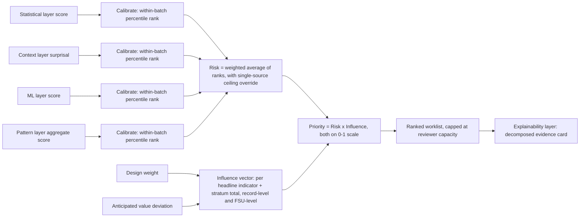
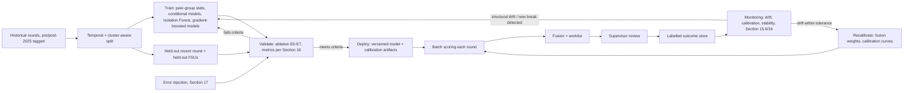
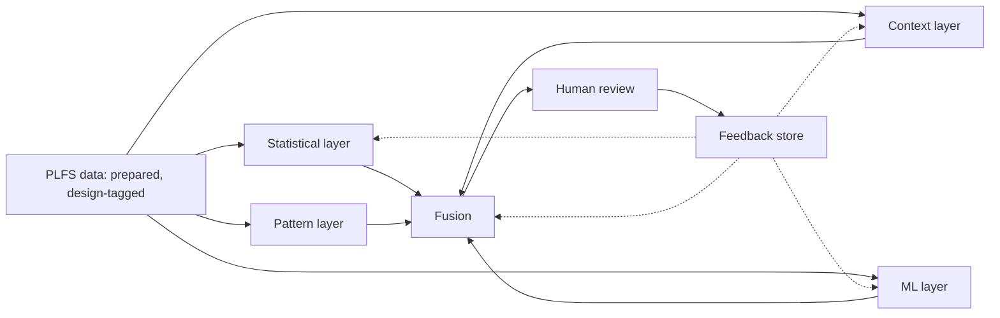

# Intelligent Survey Data Validation Platform for PLFS
## Low-Level Architecture, Research Methodology and Implementation Design

*Prepared for: Household Survey Division (HSD), National Statistical Office (NSO), Ministry of Statistics and Programme Implementation (MoSPI), Government of India*
*Scope: Design and Development of an Intelligent Survey Data Validation Platform using Probabilistic and Machine Learning Techniques — initial target survey: Periodic Labour Force Survey (PLFS)*

> **Notation used throughout this document**
> - `[Established]` — supported by cited literature or documented NSO/MoSPI material.
> - `[Reasoned]` — a technical inference built on established principles, not itself directly evidenced.
> - `[Proposed]` — a design choice or research idea original to this document, to be tested.
> - `[Requires confirmation from HSD/NSO]` — depends on internal information (schedules, eSigma internals, enumerator identifiers, correction logs, supervisor workflows) that is not publicly documented and must be verified with HSD before implementation.

---

## Table of Contents

1. Executive Summary
2. High-Level Architecture Interpretation
3. Problem Definition
4. End-to-End Low-Level Architecture
5. Data Preparation Layer
6. Peer-Group Construction
7. Statistical Layer
8. Context / Probabilistic Layer
9. Machine Learning Layer
10. Pattern / Group / Temporal Layer
11. Fusion / Evidence Combination Layer
12. Explainability Layer
13. Human Review Workflow
14. Feedback and Model Improvement
15. Training and Validation Strategy
16. Evaluation Framework
17. Error Injection Framework
18. Production Deployment Architecture
19. Version 1 vs Version 2
20. Risks and Failure Modes
21. Research Questions / Novel Contributions
22. Implementation Roadmap
23. Recommended Final Architecture
Appendix — Reference List

---

## 1. Executive Summary

Computer-Assisted Personal Interviewing (CAPI) hard and soft checks in PLFS already remove records that are internally inconsistent or outside fixed bounds. What survives is a class of error that is **individually plausible but contextually wrong** — a monthly earning that is a valid number but implausible for that person's occupation, education and location; a household that is internally consistent but structurally unlike anything else in its stratum; a First-Stage Unit (FSU) whose response pattern is statistically unlike its neighbours. Deterministic rules cannot catch this class of error because catching it requires a *reference group* and a *model of what is normal for that group* — exactly the two things a rule engine does not have.

This document designs the low-level architecture of a platform that supplies that reference: four complementary evidence sources (statistical, contextual/probabilistic, machine-learning, and pattern/temporal), combined through a transparent fusion layer into a **risk × influence** priority score, explained in plain language, and handed to a human supervisor who alone decides whether a record is wrong. The system's job is triage, not adjudication — it is designed to answer "which of these 50,000 records deserve five minutes of a supervisor's attention" rather than "which records are incorrect."

The design is deliberately conservative in three respects that matter for a government statistical office:

- **Statistically defensible**: every peer group, quantile, and probability estimate is built to respect PLFS's stratified multi-stage design, its 2025 structural break, and its small-cell problem, rather than treating PLFS as an i.i.d. table of rows.
- **Modest in its use of ML**: gradient-boosted trees and Isolation Forest are recommended as the core Version-1 ML components because they fit tabular, high-cardinality, partially-missing survey data; deep learning, autoencoders and embeddings are placed in a clearly labelled research track, not V1, because there is no evidence yet that they add value proportionate to their cost and opacity for this data.
- **Resource-realistic**: the entire pipeline is designed to run in batch, on commodity government hardware, using open-source Python/PostgreSQL tooling, matching the project's zero-budget, open-source-only constraint.

Every methodological choice below is mapped to a purpose (Table A), every anomaly type the system targets is mapped to the layer that catches it (Table B), every ML candidate is scored against PLFS's actual structure and either accepted, deferred to research, or rejected with reasons (Table C), and every claim is tagged `[Established]`, `[Reasoned]`, `[Proposed]`, or flagged as needing HSD confirmation, per the source-validation rule governing this document.

---

## 2. High-Level Architecture Interpretation

### 2.1 What the attached diagram specifies

The attached slide (*Intelligent survey data validation — architecture flow*) lays out five horizontal stages, colour-coded blue (automated) and coral (human-controlled):

| Stage | Boxes | Function |
|---|---|---|
| 1. Foundation | PLFS survey data → Data preparation & basic integrity → Existing/known rule checks | Produces a complete, structured, correctly linked input dataset and flags clear rule violations (deterministic CAPI-style checks) |
| 2. Intelligent validation (four parallel evidence sources) | Statistical checks · Context checks · Machine learning checks · Pattern checks | "Unusual vs. similar group" · "Answer fits other details" · "Unusual answer combinations" · "Across groups, regions, time" — four independent lenses on the same record |
| 3. Evidence combination | Combine all evidence → Risk + potential impact → Prioritized records for review | All four signals fused into a single risk-ranked worklist |
| 4. System output boundary | "flag + reason + priority — never correct/incorrect" | An explicit, load-bearing design constraint: the automated system's output is *always* an advisory triple, never a verdict |
| 5. Human loop | Supervisor review → Decision/correction/audit trail → Feedback for future improvement | Human review is the only place a value changes; confirmed decisions feed back into the system |

### 2.2 Core design philosophy (preserved, not replaced)

Four principles are load-bearing in the source diagram and are preserved unchanged in the low-level design below:

1. **Evidence, not verdicts.** The explicit label "never correct/incorrect" on the output boundary is the single most important constraint in the whole document. It rules out any design in which a model directly edits, imputes, or auto-corrects a value.
2. **Plural, independent evidence sources.** Four *different kinds* of question (distributional, contextual, multivariate/ML, group-temporal) are asked in parallel rather than one composite model asked once. This is preserved because each question has a different failure mode, and their combination is what makes the system auditable (Section 11).
3. **Risk and impact are separate concepts**, combined only at the fusion stage. This anticipates the *selective editing* literature's risk × influence framework `[Established]` (Latouche & Berthelot, 1992; Hidiroglou & Berthelot, 1986) — see Section 11.3.
4. **A closed human-in-the-loop feedback cycle.** Supervisor decisions are recorded and used to refine the system, not merely archived.

### 2.3 Where the high-level diagram is intentionally simplified

The slide is a communication artifact, not a specification, and is silent on several things a low-level design must resolve. Expanding these does not change the diagram's purpose:

- It does not show **peer-group construction**, which every one of "statistical," "context," and part of "pattern" checks depends on. Section 6 makes this an explicit, shared layer feeding all four evidence sources rather than something each layer re-derives independently.
- It does not show the **survey design** (stratification, clustering, weights, panel structure, the January 2025 redesign) entering the pipeline anywhere. Section 4 and Part G place these explicitly at the data-preparation and peer-group stages.
- It shows "Pattern checks" as a peer of Statistical/Context/ML, but the detailed task brief asks for Statistical + Context + ML + Fusion as the primary low-level focus, with pattern evidence feeding in as a surrounding signal. This document keeps Pattern as a first-class evidence source at the diagram level (fidelity to the original) while treating it, in the low-level design, as substantially reliant on FSU/cluster-level and temporal aggregates rather than record-level modelling (Section 10) — a technical refinement, not a philosophical change.
- "Risk + potential impact" is named but not defined. Section 11 makes this precise and — per the task's explicit instruction — independently validates rather than simply inherits the Risk × Influence framework.

### 2.4 Risks identified in the high-level architecture

`[Reasoned]` — these are risks in translating the diagram to a working system, not flaws in the diagram's intent:

| Risk | Why it matters | Where this document addresses it |
|---|---|---|
| Four evidence boxes drawn as parallel and equal could be read as "average four scores" | Naively summed/averaged scores are not comparable across sources with different scales and false-positive profiles; this is a classical pitfall in evidence fusion `[Established]` | Section 11 (calibration before fusion) |
| No explicit peer group stage | Every "unusual vs similar group" comparison is meaningless without a statistically defensible group | Section 6 |
| No explicit survey-design layer | Cluster/weight-blind comparisons will systematically flag small FSUs and rare strata | Section 4, Part G equivalent throughout |
| "Machine learning checks" could be read as license to use one large opaque model as final judge | Contradicts the diagram's own "never correct/incorrect" and "reason" requirements | Section 9.6 — ML is deliberately scoped to one evidence stream among several |
| No explicit treatment of the Jan-2025 structural break | Training one model across the break silently mixes two different data-generating processes | Section 15.5 |

---

## 3. Problem Definition

### 3.1 What CAPI hard/soft validation already catches `[Reasoned]`

CAPI instruments typically enforce two classes of check at the point of entry: **hard checks** (structural impossibilities — a negative age, a status code outside its valid list, a skip pattern violated) that block progression, and **soft checks** (range/plausibility warnings — an unusually high value — that the interviewer can override with justification). Both are **record-internal and univariate-to-low-dimensional**: they compare a field to a fixed rule or to a small number of other fields in the *same* record. `[Requires confirmation from HSD/NSO: exact CAPI edit specification and current soft-check thresholds for the PLFS schedule.]`

### 3.2 What survives deterministic validation

Errors survive CAPI checks precisely when they are **valid in isolation but wrong in context**. Four archetypes:

- **Plausible-but-wrong values**: a reported wage that passes every hard/soft bound but is 40× the median for that occupation-education-location cell.
- **Cross-field errors that are each individually valid**: an occupation code and an industry code that are each legitimate NCO/NIC codes but almost never co-occur.
- **Structural/relational errors**: a household roster that is internally consistent but statistically unlike comparable households (e.g., an implausible age structure).
- **Multi-record / group-level errors**: a single FSU, or a single day of an interviewer's workload, that looks statistically different from its neighbours even though every individual record within it passes CAPI checks.

None of these can be caught by a rule that only looks inside one record against fixed bounds, because "wrong" here is defined **relative to a reference distribution**, not relative to a constant.

### 3.3 Why a value can be individually valid but still suspicious `[Reasoned]`

A value is a coordinate in a high-dimensional space of (demographic, occupational, geographic, temporal) context. Hard/soft bounds define an axis-aligned box in that space wide enough to contain every legitimate value nationally. A record can sit inside that box yet be far outside the much smaller, conditional region where records *like it* actually live. This is precisely the distinction the anomaly-detection literature draws between **global** and **contextual (conditional) anomalies**: an object that is unremarkable against the whole population but anomalous against its reference group, or vice-versa `[Established]` (Song, Wu, Jermaine & Ranka, 2007, "Conditional Anomaly Detection," *IEEE TKDE*). Song et al. formalise this by splitting variables into **environmental/contextual attributes** (which define the reference group, e.g. occupation, education, geography) and **indicator/behavioural attributes** (the values being judged, e.g. earnings, hours) — a split this document adopts directly in Sections 6 and 8.

### 3.4 Contextual anomaly vs. distributional anomaly — precise definitions used in this document

- **Distributional anomaly** `[Proposed definition, standard usage]`: a value lies in a low-density region of the *marginal* distribution of that variable, ignoring context (e.g., a national percentile of earnings). This is what classical univariate/robust statistics (Section 7) detects.
- **Contextual anomaly** `[Established, Song et al. 2007]`: a value lies in a low-density region of the *conditional* distribution given a defined peer group (e.g., earnings given occupation × education × location). A record can be a contextual anomaly without being a distributional anomaly and vice versa; the system needs both lenses because they catch different error mechanisms (Table B).

### 3.5 What a peer group means in PLFS `[Reasoned, built on 3.3]`

A peer group is the set of records sharing enough context (sector, geography, age band, education, broad occupation/industry, employment type) that comparing their behavioural variables (earnings, hours) is meaningful, while remaining large enough that the comparison is statistically stable. Peer-group construction is therefore a bias/variance trade-off, detailed in Section 6.

### 3.6 Why historical data is useful, and why it cannot be treated as truth `[Reasoned]`

Historical PLFS rounds are the only available proxy for "what normal looks like" in the absence of a labelled error corpus, so conditional distributions, anticipated values, and ML training sets must draw on them. But released historical data has already passed through CAPI and (to an unknown, `[Requires confirmation from HSD/NSO]` extent) manual editing — it is **edited data, not ground truth**, and it contains its own undetected residual errors and any systematic biases in past interviewer/supervisor practice. Concretely this means: (a) historical quantiles used as "anticipated values" (Section 7) can themselves be contaminated by undetected errors, which is precisely why robust (not classical) estimators are specified throughout; and (b) an ML model trained uncritically on historical data can learn to reproduce past editing conventions rather than the true underlying process (Section 15.7).

### 3.7 Why the PLFS sample design matters to anomaly detection `[Established]`

PLFS is a stratified multi-stage design (state/UT → district-level stratum → FSU → household), not a simple random sample. Two consequences for anomaly detection:

- **Clustering inflates apparent extremity.** Records within the same FSU are correlated (shared enumerator, shared local labour market); a small FSU can appear "anomalous" purely from sampling noise around a real local effect, not from a data-quality problem. Peer-group and pattern-layer statistics must therefore be built with **minimum cell sizes and shrinkage/pooling toward higher strata** (Section 6.3), not raw per-FSU statistics.
- **Design-based inference and model-based anomaly detection answer different questions**, and must not be conflated (Section 3.8).

### 3.8 Why survey weights should generally be separated from record-level risk detection `[Established general principle from selective editing literature]`

The selective-editing literature draws a sharp line between a value's *plausibility* (a property of the record, independent of how many population units it represents) and its *influence on a published estimate* (which depends directly on the design weight). Weights answer "how much does this record matter to the total," not "is this record likely to be wrong." Feeding raw design weights into an ML feature vector conflates the two questions and risks the model learning "high-weight records are inherently different" as a spurious pattern rather than learning genuine plausibility. The correct place for weights is the **influence** side of the risk × influence score (Section 11.3), computed after risk is estimated, never as an input feature to the risk model itself. `[Reasoned, extending Latouche & Berthelot 1992's risk/influence decomposition]`

### 3.9 Why the January 2025 PLFS redesign creates a structural break `[Established]`

From January 2025, PLFS moved to a **monthly rotational panel**: each household is visited four times across four consecutive months (one first-visit schedule, three revisit schedules), with 75% FSU matching between consecutive months and 50% between consecutive quarters; district (rather than the earlier NSS-region-based scheme) is now the basic stratum for FSU selection in most of the geography, sub-stratification was introduced in urban areas, and the first-stage selection method changed; the panel itself rotates over a 2-year duration before the sampling frame is refreshed (PIB/MoSPI, "Changes in Periodic Labour Force Survey (PLFS) from 2025," 2025; NCAER, "Inside the new Periodic Labour Force Survey," 2025). Pre-2025 PLFS had **no revisit provision for rural households** and only quarterly (not monthly) urban revisits. This is a genuine structural break in the data-generating process along at least three dimensions relevant to this platform:

1. **Panel structure changed** — pre-2025 models of "expected change between visits" cannot be naively reused post-2025, because the revisit cadence and matching rate are different.
2. **Stratification changed** (NSS-region-based → district-based in most areas) — peer groups and FSU-level pattern baselines built on the old stratum definitions do not carry over.
3. **Sample selection method changed** — this can shift the marginal distributions of some variables even absent any real economic change, which a model blind to the break would misread as "anomalous."

Consequently — and this is a specific, load-bearing recommendation, not a side note — **no model in this platform should be trained on data pooled across the January 2025 boundary without an explicit break indicator or separate pre/post treatment** (elaborated in Section 15.5).

### 3.10 Why panel/revisit information creates a distinct validation signal `[Reasoned, from 3.9]`

Because each post-2025 household is observed up to four times, the *within-household, across-visit* trajectory of activity status, occupation, industry and earnings is itself informative: an implausible month-to-month transition (e.g., a full reversal of activity status with no corroborating change, or an earnings jump inconsistent with any reported occupation change) is a validation signal that a single cross-sectional snapshot cannot produce. This is architecturally a different signal from peer-group comparison — it compares a unit to *itself* over time — and is treated as its own evidence line in Section 10.

### 3.11 What can be done with public PLFS microdata vs. what needs internal HSD data `[Established / flagged]`

Public unit-level PLFS microdata (via microdata.gov.in / NADA) is released as household- and person-level files per visit, carrying FSU serial number, second-stage stratum, sample household number, NIC (industry) and NCO (occupation) codes, and the standard schedule blocks — sufficient to build peer groups, conditional models, and FSU-level aggregates. It does **not** carry a true enumerator identifier, nor a pre-edit/post-edit correction log, nor paradata (interview duration, GPS, timestamps) as far as this document can verify from public documentation. Therefore:

- **FSU-level or second-stage-stratum-level pattern monitoring is achievable from public/HSD production data as designed.**
- **True enumerator-level monitoring, paradata-based curbstoning detection (Section 10.4), and any evaluation against actual correction outcomes (Section 17) require additional internal HSD information** and are marked `[Requires confirmation from HSD/NSO]` wherever they appear below. This document explicitly does **not** assume one FSU equals one enumerator; that mapping must be independently verified with HSD before any true "interviewer effect" claim is made.


---

## 4. End-to-End Low-Level Architecture

The low-level design keeps the five stages of the source diagram but makes the survey-design layer and peer-group layer explicit, and threads the panel/pattern signal through all four evidence sources rather than isolating it in one box.

**Diagram 1 — Complete low-level validation architecture**

```mermaid
flowchart TB
    subgraph S0["Stage 0 — Ingestion & Foundation"]
        A1[PLFS unit-level data: household + person files, per visit]
        A2[Data preparation, schema & integrity checks]
        A3[Deterministic CAPI-equivalent rule checks]
        A4[Survey-design metadata: stratum, FSU, panel wave, weight, pre/post-2025 flag]
        A1 --> A2 --> A3
        A4 --> A2
    end

    subgraph S1["Stage 1 — Shared Reference Layer"]
        B1[Peer-group construction engine]
        B2[Historical reference store: pooled prior rounds, robust anticipated values]
    end

    A3 --> B1
    A4 --> B1
    B2 --> B1

    subgraph S2["Stage 2 — Four Evidence Sources (parallel)"]
        C1[Statistical layer: robust quantiles, IQR/MAD, conditional quantiles]
        C2[Context/probabilistic layer: conditional models, surprisal]
        C3[ML layer: Isolation Forest, gradient-boosted conditional models, duplicate detection]
        C4[Pattern/temporal layer: FSU & stratum aggregates, panel/revisit consistency, drift]
    end

    B1 --> C1
    B1 --> C2
    B1 --> C3
    B1 --> C4
    A3 --> C1
    A3 --> C2
    A3 --> C3
    A3 --> C4

    subgraph S3["Stage 3 — Fusion"]
        D1[Score calibration per source]
        D2[Risk estimation]
        D3[Influence estimation using design weights]
        D4[Priority = f(Risk, Influence), decomposable]
    end

    C1 --> D1
    C2 --> D1
    C3 --> D1
    C4 --> D1
    D1 --> D2
    D2 --> D4
    D3 --> D4

    subgraph S4["Stage 4 — Explainability & Output"]
        E1[Human-readable evidence card per flag]
        E2[Ranked worklist, never a corrected value]
    end

    D4 --> E1 --> E2

    subgraph S5["Stage 5 — Human Review"]
        F1[Supervisor review UI]
        F2[Decision: confirm error / confirm valid / inconclusive]
        F3[Audit trail]
    end

    E2 --> F1 --> F2 --> F3

    subgraph S6["Stage 6 — Feedback"]
        G1[Labelled outcome store]
        G2[Recalibration & retraining trigger]
    end

    F2 --> G1 --> G2
    G2 -.->|periodic batch retrain| C1
    G2 -.-> C2
    G2 -.-> C3
    G2 -.-> D1
```

### 4.1 Design commitments encoded in this diagram

- **The peer-group engine (B1) sits upstream of all four evidence sources** and is queried by each, rather than each layer building its own ad hoc grouping — this is the single most important structural addition over the high-level diagram, because it guarantees the four evidence sources are asking their different questions about the *same* reference group, which is what makes fusion in Stage 3 interpretable.
- **Survey-design metadata (A4) — stratum, FSU, panel wave, weight, and an explicit pre/post-2025 indicator — is attached at ingestion**, not derived later, so every downstream layer can condition on it.
- **The feedback loop (Stage 6) writes back only to model *parameters* (recalibration, retraining), never to the data.** The only path that changes a record's value is the human decision in Stage 5, matching the "never correct/incorrect" boundary from the source diagram.


---

## 5. Data Preparation Layer

**Purpose**: turn raw per-visit household/person files into a single analysis-ready panel with survey-design metadata attached, before any evidence source runs.

| Step | What happens | Input | Output |
|---|---|---|---|
| Schema validation | Confirm each field matches its documented code list/type (NIC, NCO, status codes, etc.) | Raw CHHV/CPERV-style files `[Requires confirmation from HSD/NSO for the exact current schedule layout]` | Schema-conformant table; a reject list of records with undocumented codes |
| Linkage | Join household ↔ person records within a visit using the common key (quarter, FSU serial no., hamlet/sub-block, second-stage stratum, sample household no.) `[Established structure, per MoSPI README documentation]`; join visit 1–4 for the same household under the post-2025 panel | Schema-conformant household + person files | Person-visit-linked, and where applicable household-panel-linked, table |
| Deterministic rule pass | Apply the existing CAPI-equivalent hard/soft edit rules (Section 3.1) | Linked table | Records flagged by deterministic rules routed directly to the existing correction process; the *unflagged* remainder is what enters intelligent validation |
| Survey-design tagging | Attach stratum ID, FSU ID, second-stage stratum, panel wave/visit number, design weight, rural/urban, and a binary `pre_2025` / `post_2025` indicator | Linked table + sampling frame metadata | Design-tagged analysis table |
| Feature preparation | Derive analysis variables: broad and detailed occupation/industry groupings (to manage NCO/NIC cardinality — Section 9.3), age bands, education bands, per-hour earnings, activity-status transition codes (post-2025 panel only) | Design-tagged table | Feature table consumed by Stage 1 (peer groups) and Stage 2 (evidence sources) |
| Missingness handling | Distinguish **structural missingness** (not-in-universe, e.g., "industry" is undefined for someone not working) from **item non-response**; never impute a value used as a behavioural (target) variable for anomaly scoring — flag it as "not assessable" instead | Feature table | Feature table + explicit missingness/applicability mask |

**Failure handling**: a record that fails schema or linkage is routed to a manual-fix queue and excluded from all four evidence sources until resolved — it is never silently dropped or silently imputed, because a systematically failing linkage step is itself a data-quality signal worth surfacing to supervisors (Section 10.3).

**Storage**: the design-tagged feature table plus the missingness mask are the versioned inputs every downstream layer reads; they are stored with the ingestion batch ID and code-list version so that any later result is reproducible against the exact inputs that produced it.

---

## 6. Peer-Group Construction

### 6.1 Principle

A peer group is the reference population against which a record's behavioural variables (earnings, hours, etc.) are judged. It must be **narrow enough to be genuinely comparable** and **wide enough to be statistically stable** — the central bias/variance trade-off of conditional inference. `[Reasoned, standard statistical principle]`

### 6.2 Candidate stratifying variables

Sector (rural/urban), state/UT, broad age band, broad education level, broad occupation group (NCO 1-digit or 2-digit), broad industry group (NIC section), and employment/activity-status type are the natural candidates, mirroring the "environmental/contextual attributes" of conditional anomaly detection `[Established, Song et al. 2007]`. Not all six are used simultaneously for every behavioural variable — the grouping is chosen per behavioural variable based on which contextual variables are known (from labour economics and from prior PLFS reports) to explain most of its variation; e.g., earnings peer groups prioritise occupation × education × sector × geography, while hours-worked peer groups prioritise employment type × industry.

### 6.3 Preventing peer groups from becoming too small

`[Established general technique, hierarchical/small-area estimation literature]` A strict cross of six variables produces thousands of near-empty cells. This is managed with a **minimum-cell-size threshold** (e.g., a working floor, to be tuned during pilot, on the order of 30–50 comparable records — the exact figure `[Proposed, to be validated empirically]`) and a **backoff hierarchy**: if a cell falls below the floor, collapse the *least informative* stratifying dimension first (typically the finest geography level, e.g., district → state) and recompute, continuing until the floor is met. This is the same logic used in small-area estimation and in hierarchical/multilevel modelling's partial pooling: rather than a hard cliff at some sample size, group-level estimates can also be **shrunk toward the parent group's estimate** in proportion to the group's sample size (empirical-Bayes/hierarchical shrinkage), which degrades gracefully instead of discretely switching reference groups. `[Reasoned extension]`

### 6.4 When pooling or hierarchical approaches are needed

Pooling across geography is needed whenever a state/district/occupation combination is inherently rare in the sample (a specific concern given PLFS's initial state-level, not district-level, precision target for many indicators `[Requires confirmation from HSD/NSO for current district-level sample sufficiency]`). Hierarchical (multilevel) approaches are preferred over ad hoc pooling wherever the platform needs a *smooth* function of group size rather than a hard cutoff — in practice, this matters most for the context/probabilistic layer's conditional models (Section 8) and least for simple descriptive statistics, where the discrete backoff of 6.3 is transparent enough for supervisor-facing explanations and is preferred for that reason.

### 6.5 Cluster (FSU) effects

Peer groups are always defined *across* FSUs, not within one — comparing a household only to other households in its own FSU would conflate genuine local effects (a poor rural FSU that is legitimately different) with data-quality problems. FSU-level pattern checks (Section 10) are a separate, explicitly cluster-aware evidence line precisely so that this distinction is not blurred inside the peer-group statistics.

### 6.6 Panel awareness in peer-group construction

Post-2025, a peer group used for cross-sectional comparison should be built from *the same visit number / month* wherever seasonal effects matter (e.g., agricultural employment), to avoid comparing a first-visit record to a fourth-visit record whose season differs, unless the behavioural variable is not seasonally sensitive. `[Reasoned]`


---

## 7. Statistical Layer

### 7.1 Role

Answers: **"Is this value distributionally or peer-conditionally extreme, using methods that make no distributional assumption stronger than the data can support?"** This is the layer closest to classical statistical data editing and is deliberately the most conservative and most explainable of the four.

### 7.2 Record-level numerical anomalies (earnings, hours, expenditure-type continuous variables)

`[Established]` Survey earnings/expenditure data is famously heavy-tailed and contains genuine (not erroneous) extreme values, so classical mean/SD-based (z-score) methods are inappropriate — a single genuine high earner can inflate the mean and SD enough to mask other real errors, and the method itself has no protection against the very contamination it is meant to detect. Robust alternatives are required.

### 7.3 Peer-group anomalies

The central technique is comparing a value not to the national distribution but to its **conditional (peer-group) distribution**, i.e., a **conditional quantile** or **conditional robust z-analogue**: "where does this value sit within its own peer group's distribution."

### 7.4 Table D — Statistical / Probabilistic Methods → Purpose → PLFS Fit → Decision

| Method | Statistical intuition | Input | Output | When to use | When not to use | Strengths | Weaknesses | Computational cost | Interpretability | Failure modes | PLFS fit / decision |
|---|---|---|---|---|---|---|---|---|---|---|---|
| Robust quantiles (median, percentile bands) | Order-statistic based; unaffected by extreme values that don't change rank near the centre | Peer-group values of one behavioural variable | Percentile position of the record within its peer group | Any continuous variable, any peer-group size ≥ floor | Extremely small groups (percentile is undefined/unstable) | Simple, transparent, exactly the language in the target explanation ("peer percentile: 99.97%") | Says nothing about *why*; ignores multivariate context | Very low | Very high — directly supervisor-readable | Unstable at small n; sensitive to peer-group definition choice | **Accept — core V1 method** |
| IQR / MAD (median absolute deviation) | Robust dispersion analogues of range/SD; a modified z-score using median and MAD is resistant to the very outliers it is scoring | Peer-group values | Robust z-analogue per record | Continuous variables with heavy tails (earnings, expenditure) | Categorical/count variables with many ties (MAD can be zero) | Standard, well-documented robust-statistics tool; interpretable as "how many robust SDs from the peer median" | Breaks down when >50% of a small peer group is contaminated (a genuine risk in tiny cells); MAD = 0 with many ties needs a fallback | Low | High | Zero-MAD collapse in sparse/discrete peer groups | **Accept — core V1 method, paired with the minimum-cell-size rule in 6.3** |
| Conditional quantiles (quantile regression / grouped empirical quantiles) | Generalises "peer-group percentile" to a smooth function of continuous context (e.g., age) instead of discrete bins only | Behavioural variable + mixed categorical/continuous context | Estimated conditional quantile function; record's position relative to it | When context includes continuous variables (age, years of experience) that discrete peer-group binning would waste | Very small samples (quantile regression needs enough data per region of covariate space) | Avoids arbitrary bin edges; smooth, defensible | Harder to explain to a non-technical supervisor than a plain percentile; more fitting decisions (which covariates, what smoothing) | Moderate | Moderate | Poor fit in sparse covariate regions; overfitting with many covariates | **Accept — V1, only where continuous context genuinely matters (e.g., age-earnings profiles); default to discrete peer groups elsewhere for simplicity** |
| Robust multivariate methods (e.g., Minimum Covariance Determinant / robust Mahalanobis distance) | Distance from a robustly-estimated multivariate centre, downweighting the effect of outliers on the estimated centre/covariance itself | A small set of jointly-analysed continuous variables (e.g., earnings + hours) | Multivariate outlier flag/score | A handful of continuous variables that must be judged jointly (e.g., earnings implausible *given* hours) | High-dimensional or mixed categorical-heavy data (breaks down; also not this layer's job — that is Section 8/9) | Captures joint implausibility a univariate check would miss (very high earnings *for* very low hours) | Computationally and conceptually heavier; harder to explain than a univariate percentile | Moderate | Moderate | Sensitive to which variables are included; unstable in small peer groups | **Accept — V1, narrowly scoped to earnings×hours-type joint checks; not a general-purpose tool here** |
| Period-to-period / revisit comparison | Compares a unit's own value across panel visits rather than to peers | Same household/person across post-2025 visits | Deviation from the unit's own trajectory / from typical revisit change patterns | Post-2025 panel data only, for units with ≥2 visits | Pre-2025 rural data (no revisit) or first-visit-only records | Directly exploits the new panel design; catches errors invisible to any cross-sectional peer comparison | Requires correct panel linkage; conflates real change with error | Low | High ("earnings changed 5× between visit 1 and 2 with no reported activity-status change") | Mislinked panel records corrupt this entirely | **Accept — V1, but gated on panel-linkage quality checks from Section 5** |
| Distribution / heaping (digit) indicators | Detects excess mass at round numbers or specific terminal digits versus the expected roughly-uniform terminal-digit distribution | A single reported continuous field across many records (e.g., earnings, hours) | A heaping/digit-preference score at the aggregate (FSU/enumerator-proxy/stratum) level | Screening for rounding behaviour, and as one interviewer-fabrication indicator alongside others `[Established, Biemer & Stokes-style leading/terminal-digit methods]` | Record-level flags (this is inherently an aggregate diagnostic, not a per-record one) | Cheap, well-precedented in survey-methodology literature for detecting rounding and some forms of fabrication | Aggregate-only; cannot by itself indict a single record or (without verified enumerator IDs) a single interviewer | Very low | Moderate (needs methodological framing for supervisors) | False positives from genuinely round real-world pay scales (e.g., statutory minimum wages) | **Accept — V1, routed to the Pattern layer (Section 10), not the record-level Statistical layer** |
| Simple parametric z-score / SD-based rules | Classical mean ± k·SD | Any continuous variable | Z-score | Never as a standalone flagging rule on raw survey earnings/expenditure data | Heavy-tailed survey variables (which is most of the behavioural variables in PLFS) | Trivial to compute | Not robust to the very contamination it is meant to find; masking and swamping effects are well documented | Negligible | High but misleading | Silently fails in the presence of real extreme values | **Reject as a standalone method; retained only as a documented contrast baseline in the evaluation ablation (Section 16)** |

### 7.5 Summary decision for the Statistical layer

Version 1 uses **robust quantiles + MAD-based robust z-analogues** as the default, **conditional quantiles** where continuous context genuinely matters, **robust multivariate distance** narrowly for earnings×hours-type joint checks, **revisit-comparison** for the post-2025 panel, and routes **heaping/digit indicators** to the Pattern layer rather than treating them as a record-level statistical check. Classical parametric z-scores are explicitly rejected as a production method and kept only as an ablation baseline.


---

## 8. Context / Probabilistic Layer

### 8.1 Central question

**"Is this response unusual given the characteristics of this person/household and their context?"** — this is precisely the **conditional (contextual) anomaly detection** problem `[Established, Song et al. 2007]`: attributes split into **context/environmental** (education, geography, sector, employment type — the variables that define "given what") and **behavioural/indicator** (occupation choice, income level, hours, activity status — the variables being judged). A response can be rare nationally but normal for its context (a high-value occupation is nationally rare but typical for postgraduates in a metro), and a response can be common nationally but unusual for its context (a very common occupation nationally may be highly atypical for a specific education level).

This layer differs from the Statistical layer (Section 7) in kind, not just degree: Section 7 asks "where does this continuous value sit in its peer group's distribution," while this layer additionally handles **categorical and mixed categorical/numeric** responses (an occupation code, an activity-status transition) and expresses the answer as a **probability/surprisal**, retained alongside a human-readable frequency statement.

### 8.2 Candidate approaches

- **Conditional categorical models** — for a categorical behavioural variable (occupation given education/geography/sector), estimate P(behavioural value | context) directly as conditional relative frequencies within the peer group, with the same small-cell handling as Section 6.3 (backoff / hierarchical shrinkage). `[Reasoned, direct application of 6.3's machinery to categorical outcomes]`
- **Conditional quantile models** — as in Section 7.4, reused here for continuous behavioural variables where the "surprisal" framing (below) is preferred over a plain percentile, e.g., when the explanation needs to combine categorical and continuous unusualness into one number.
- **Probability / surprisal-based scoring** — score = −log P(observed value | context), estimated from the conditional model above. This unifies categorical and continuous behavioural variables under one comparable scale before fusion (Section 11), while the **human-readable form** ("this occupation occurs in only 3 of 180,000 comparable records") is always generated and shown alongside the raw score — per the explicit instruction that the human-readable evidence should be treated as a first-class output, not a footnote to a mathematical one.
- **Hierarchical models** — used specifically to let small peer groups borrow statistical strength from larger, related groups when estimating a conditional probability, rather than falling back to an arbitrary uniform prior at the discrete cell-collapse boundary. `[Established general technique — multilevel/hierarchical models for grouped data]` Recommended for occupation-given-context modelling where cardinality is very high (Section 8.4) and cell counts are frequently small.
- **Calibrated conditional models** — a raw model probability is not automatically a real-world frequency; calibration (e.g., isotonic regression against held-out outcomes, once a labelled outcome store exists per Section 14) is required before a probability/surprisal number is shown to a supervisor as if it were a frequency. Until a labelled outcome store exists, the human-readable frequency statement ("3 of 180,000") is used *in place of* an uncalibrated probability claim, precisely to avoid overstating what the model knows — the calibration requirement is why the explanation example in Part F of the task brief prefers frequency language to a raw score.

### 8.3 Worked examples mapped to this layer

- Occupation given education, geography, sector — conditional categorical model.
- Income given occupation, education, geography, employment type — conditional quantile model (Section 7.4) reused with surprisal framing.
- Employment status given demographic characteristics — conditional categorical model; post-2025 also compared against the panel-transition model in Section 10.
- Hours given occupation and employment arrangement — conditional quantile model.
- Household characteristics given household composition — conditional categorical/multivariate model over roster-derived features.

### 8.4 Handling operational difficulties

- **Rare categories**: hierarchical shrinkage (8.2) rather than treating a rare-but-legitimate category (e.g., an uncommon but real occupation) as automatically suspicious; the frequency is reported, the decision is left to the supervisor.
- **Missing / not-in-universe fields**: the Section 5 applicability mask is consulted before scoring — a not-in-universe field is never scored as "surprising," only a genuinely missing-when-expected field is.
- **High-cardinality categorical variables** (NCO/NIC run to hundreds/thousands of codes): scored at multiple levels of a natural hierarchy (e.g., NCO 1-digit → 2-digit → full code) so that a rare *detailed* code within a common *broad* group is not conflated with a code that is unusual even at the broad level — this is both a cardinality-management technique and a genuine source of graded evidence (Table B).
- **Small peer groups**: same backoff/shrinkage machinery as Section 6.3, applied to the conditional probability estimate itself.
- **Fairness / subgroup effects** `[Reasoned]`: because peer groups are explicitly built from demographic and geographic context, the platform must monitor whether flag rates are systematically higher for particular states, castes/social groups (where recorded), or genders **after conditioning on legitimate context** — a persistent excess would indicate a modelling problem (e.g., an omitted context variable), not a genuine data-quality difference, and is tracked as a subgroup-stability metric in the evaluation framework (Section 16.4).
- **Interpretability**: the human-readable frequency statement is mandatory output, not optional, for exactly the reason given in the task brief — "surprisal = 11.2" is not actionable for a supervisor, "this occupation occurs in only 3 of 180,000 comparable records" is.


---

## 9. Machine Learning Layer

### 9.1 Role — deliberately bounded

This layer answers exactly one question: **"Is there a multivariate pattern here that the statistical and context layers may have missed?"** It is one of four evidence sources feeding fusion (Section 11), never the system's final judge — a direct consequence of the source diagram's "never correct/incorrect" boundary and of the explicit instruction not to let the ML layer become "the identity of the whole system."

### 9.2 Why deep learning is not the default

`[Established]` PLFS data is structured/tabular, with many categorical variables, high-cardinality codes (NCO/NIC), structural missingness, and survey-design clustering. A large benchmark comparison of 33 unsupervised anomaly-detection algorithms across 52 real-world tabular datasets found (Extended) Isolation Forest to be the strongest general-purpose performer, with local-density methods (LOF) preferable specifically when the data contains multiple genuine clusters (Han et al., *JMLR*, "ADBench"-style large-scale benchmark, 2022) — deep, representation-learning-heavy methods are not the benchmark's top performers on tabular data of this kind, consistent with a broader, well-known pattern in tabular ML that gradient-boosted trees and simple density/isolation methods tend to match or beat deep models on structured data. `[Established general finding, widely replicated; exact PLFS-specific numbers are not available and none are asserted here]`

### 9.3 Feature engineering constraints specific to PLFS

- **High-cardinality NCO/NIC codes** are represented at multiple hierarchy levels (Section 8.4) rather than one-hot-encoded at full granularity, which would explode dimensionality and starve tree-based splits of support at each leaf.
- **Structural missingness** uses the Section 5 applicability mask as an explicit feature (native support in gradient-boosted trees for missing values is used where the missingness itself is *not* informative; where missingness is potentially informative — e.g., systematic non-response on income by high earners — it is encoded as its own category, never silently imputed).
- **Survey weights are excluded from the feature vector** (Section 3.8) — they enter only at the influence stage of fusion, not as ML model input.
- **Peer-group identifiers** (not raw geography/occupation codes) are included as features so the model can implicitly learn peer-relative patterns consistent with the shared reference layer (Section 4), rather than re-deriving an inconsistent notion of "context" from raw codes.

### 9.4 Table C — Candidate ML Models → Advantages → Disadvantages → PLFS Fit → Decision

| Model | Why it fits / doesn't | Computational requirement | Categorical handling | Missingness | Contamination sensitivity | Explainability | Scalability | Training strategy | Inference strategy | Calibration | False-positive behaviour | Production suitability | Decision |
|---|---|---|---|---|---|---|---|---|---|---|---|---|---|
| **Isolation Forest** | Fits tabular, mixed data well; makes no distributional assumption; isolates rare combinations with few splits `[Established, Liu et al. 2008/2012]` | Low — near-linear, CPU-only | Needs numeric/ordinal encoding of categoricals (peer-group IDs, ordinal bands) | Requires pre-imputed or masked input | Moderate — contamination parameter must be set conservatively, not estimated from unknown true contamination rate | Moderate with SHAP-style additive attribution (Section 12.3) | Excellent — scales to full national PLFS volumes on commodity hardware | Unsupervised, retrained per round/batch | Batch scoring | Score is a relative rank, not a probability — calibrate via percentile-of-score within a reference batch | Tends to flag globally rare combinations; can under-flag anomalies that are only unusual *locally* within one cluster | High | **Accept — core V1 ML method** |
| **Local Outlier Factor (LOF) / local-density methods** | Complementary to Isolation Forest: better where genuine sub-populations (peer groups) create multiple density modes, which is structurally true of PLFS `[Established, benchmark literature above]` | Moderate–high — distance-based, scales worse with n; mitigated by scoring within pre-formed peer groups rather than the whole national dataset | Needs a defined distance metric for mixed data (e.g., Gower distance) — added complexity | Same as above | Sensitive to the choice of k (neighbourhood size) | Lower than Isolation Forest — "local density ratio" is harder to narrate to a supervisor | Moderate if scoped to peer-group-sized neighbourhoods; poor at full national scale | Unsupervised, per peer group | Batch scoring within peer group | Same percentile-of-score approach | Catches anomalies Isolation Forest's global splits can miss within a locally dense sub-population | Moderate (scope narrowed) | **Accept — V1, but scoped to run within peer groups, not on the full national table, to control cost and improve local relevance** |
| **Gradient-boosted trees as conditional models** (e.g., quantile/LightGBM-style regression, or a classifier predicting an "anticipated value" or category) | Directly implements the anticipated-value idea from selective editing (Section 7) and the conditional model idea from Section 8, but lets the conditioning function be learned rather than manually specified, and can combine many context variables at once | Low–moderate; open-source, CPU-trainable at PLFS scale | Native categorical support in modern implementations; also handles the peer-group-ID features directly | Native handling of missing values as a distinct split direction | Needs a clean (or robustly-defined) training target; sensitive to contamination in the training target itself (Section 15.7) | High relative to other ML options — native feature-importance and SHAP support, directly extends the "human-readable evidence" requirement | Excellent | Supervised on historical anticipated-value/conditional targets, retrained per round | Batch scoring, residual (observed vs. predicted) becomes the anomaly signal, in the same spirit as classical anticipated-value scoring | Residuals can be turned into calibrated conditional quantiles/probabilities directly | Learns real conditional structure, so is more precise than Isolation Forest on the variables it targets — but only for variables with a defined, learnable target | High | **Accept — core V1 ML method, used as the learned generalisation of Sections 7–8's conditional models where enough training data exists** |
| **Duplicate / near-duplicate pattern detection** | Directly targets a named error type (copying, curbstoning-adjacent duplication) `[Established, Koczela et al. 2015 duplicate-string/near-duplicate typology, cited in AAPOR 2022 falsification task-force report]` | Low | Works on raw field values (string/record hashing, edit distance) rather than needing numeric encoding | N/A | Low — either a match is found or not | High — a duplicate flag is trivially explainable ("this record shares N of M fields with record X") | Good — pairwise comparison cost is managed by blocking (comparing only within FSU/stratum, not nationally) | Rule/algorithmic, no training needed | Batch, run per FSU/stratum block | N/A — deterministic match, not a probability | Very low false-positive rate by construction (near-identical records are rare by chance) | High | **Accept — core V1 method, run within the Pattern layer (Section 10) since duplication is inherently a cross-record, often cross-FSU phenomenon** |
| Autoencoders (reconstruction-error anomaly detection) | Learns a compressed representation of "normal" and flags high reconstruction error | Moderate–high (needs a trained neural network; GPU helpful but not strictly required at PLFS's row/column scale) | Needs numeric encoding of all categoricals — awkward for high-cardinality NCO/NIC | Needs imputation before encoding — conflicts with the "never silently impute a target variable" rule (Section 5) | Sensitive to contamination in training data (learns to reconstruct the contamination too) | Low — reconstruction error has no natural narrative for a supervisor | Moderate | Requires careful architecture/hyperparameter search | Batch | Needs post-hoc calibration | Not shown, in the general tabular-anomaly benchmark literature cited above, to outperform Isolation Forest/gradient-boosting on structured tabular data with this profile | Not proven to add value proportionate to its opacity and engineering cost here | **Research/experimental only — not V1** |
| One-Class SVM | Classical kernel-based novelty detection | Moderate–high; poor scaling with n | Needs full numeric encoding | Needs imputation | High sensitivity to kernel/hyperparameter choice and to contamination | Low | Poor at PLFS's scale without approximation | Needs careful hyperparameter tuning | Batch | Needs post-hoc calibration | Documented in the literature to be outperformed by Isolation Forest on comparable tasks, with materially worse runtime `[Established, cited comparative literature]` | Low | **Reject for V1 and for the research track** |
| Deep tabular models (e.g., TabTransformer-style architectures) | Designed to compete with gradient boosting on tabular data, but with materially more engineering and compute overhead and less mature open-source tooling for this specific use case | High relative to the alternative that already covers the same job (gradient-boosted trees) | Handles categoricals via learned embeddings | Needs explicit handling | Unclear behaviour under the contamination levels expected here | Low–moderate | Poor without GPU infrastructure, which conflicts with the project's resource constraint | Heavy | Batch | Needs calibration | Not established to outperform gradient boosting on data of this size/structure `[Established general finding in tabular-ML benchmarking]` | Conflicts with resource-efficiency requirement | **Reject for V1; note as a future-research item only if a future round shows gradient boosting saturating** |
| Embeddings for NIC/NCO codes (learned vector representations of occupation/industry codes) | Could in principle capture semantic similarity between codes better than a fixed hierarchy | Low–moderate to train | Purpose-built for this exact high-cardinality problem | N/A | Needs enough historical data per code to learn a stable embedding — many NCO/NIC codes are individually rare | Low on its own; usable only as an input to another, more explainable model | Good | Needs a large corpus, ideally pooled across several PLFS rounds | Batch, feeds into 9.4's other models as a feature | N/A | Unproven benefit over the simpler multi-level hierarchy already used in Section 8.4 for this specific application | Adds complexity without a demonstrated gain over the existing hierarchy-based approach | **Research/experimental — worth testing once several rounds of post-2025 data accumulate, not a V1 dependency** |
| Self-supervised approaches (contrastive/pretext-task representation learning for tabular anomaly detection) | An active general ML research area | High | Requires design work specific to PLFS's schema | Requires design work | Unclear | Low, currently | Unclear at this data scale | Heavy research investment | N/A | N/A | No established track record in official-statistics anomaly detection specifically | Not appropriate to commit V1 engineering effort to an unsettled research area | **Reject for V1; monitor the research literature, do not commit engineering effort now** |
| PU (Positive-Unlabeled) learning | Directly relevant *if and only if* a partial set of confirmed errors becomes available (Section 14) without a reliable "confirmed clean" set — which is exactly the label structure the supervisor feedback loop will eventually produce | Low–moderate | Compatible with the gradient-boosting method above | Compatible | Depends on positive-set reliability | Moderate, inherits the base classifier's explainability | Good | Needs an accumulated feedback store (Section 14) — not available at project start | Batch | Achievable with standard PU-calibration techniques once enough labels exist | Could reduce false positives once enough confirmed cases accumulate | Promising but premature | **Research/experimental — explicitly planned for Version 2 once the feedback store (Section 14) has accumulated enough confirmed cases; not V1 because V1 has no labels yet** |
| Active learning (for prioritising which flagged records get supervisor attention, or which to label for training) | Could make supervisor review time more efficient over time | Low | N/A | N/A | N/A | N/A | Good | Iterative, coupled to the review UI | Online (selection at review time) | N/A | Could reduce reviewer workload for equivalent detection yield | Attractive but depends on the Section 14 feedback infrastructure existing first | **Research/experimental for V2, contingent on Section 14 infrastructure; not required for V1's core detection task** |

### 9.5 Summary decision

**Version 1 ML layer** = Isolation Forest (global, cheap, high-scale) + peer-group-scoped LOF (local density, catches what Isolation Forest's global splits miss) + gradient-boosted conditional models (the learned generalisation of the anticipated-value idea) + duplicate/near-duplicate detection (routed through the Pattern layer). Everything else — autoencoders, one-class SVM (rejected outright), deep tabular models, NIC/NCO embeddings, self-supervised methods, PU learning, active learning — is either rejected or explicitly deferred to a research track with a stated reason and, where relevant, a stated precondition (an accumulated labelled feedback store) for reconsideration.

### 9.6 Why the ML layer cannot be the system's final judge — architectural enforcement, not just a stated principle

This is enforced structurally, not just declared: (a) the ML layer's outputs are scores that enter the same calibration step as the Statistical and Context layers (Section 11.1) — no privileged path exists for ML output to bypass fusion; (b) every ML score is required to carry a SHAP-style (or equivalent tree-based) feature attribution before it is allowed into the explainability layer (Section 12), so an ML flag can never appear to a supervisor without a stated multivariate reason; and (c) Version 1 explicitly excludes any auto-apply or auto-correction pathway from any ML output, consistent with the source diagram's output boundary.


---

## 10. Pattern / Group / Temporal Layer

### 10.1 Role

Answers: **"Does this record look normal individually, but sit inside a group (FSU, district, time window) that itself looks abnormal?"** This is the layer that operationalises the source diagram's "Pattern checks — across groups, regions, time" box, and it is the layer where duplicate detection (Section 9.4) and heaping/digit indicators (Section 7.4) are actually executed, because both are inherently group/aggregate diagnostics rather than record-level ones.

### 10.2 FSU-level and district-level pattern signals

- **Response-distribution shift**: compare an FSU's (or district's) distribution of a key variable to its stratum's expected distribution, using the same robust/conditional machinery as Sections 7–8 but applied at the aggregate rather than record level.
- **Reduced variance / "too clean" data**: an FSU whose responses show implausibly low variance (e.g., near-identical durations, near-identical earnings) is itself a signal, distinct from any single record being extreme `[Established motif in the interviewer-falsification literature, e.g., reduced variance as a marker discussed in AAPOR's 2022 falsification task-force report]`.
- **Digit heaping** (Section 7.4): computed at the FSU/enumerator-proxy/stratum level, following the general leading/terminal-digit-preference approach used to detect curbstoning in household survey interviews `[Established, e.g., Biemer & Stokes-style leading-digit methods, BLS working paper 2003]`.
- **Duration/short-duration patterns and duplication**: `[Requires confirmation from HSD/NSO — whether interview-duration paradata is captured and available to HSD]` if available, short-duration and duplicate/near-duplicate response-string detection (Section 9.4) are two of the more established, precedented curbstoning indicators in the survey-methodology literature `[Established, AAPOR 2022 falsification task-force report; Koczela et al. 2015 duplicate typology]`.

### 10.3 Enumerator-level monitoring — an explicit boundary

This document deliberately does **not** equate one FSU with one enumerator. Public PLFS microdata carries FSU and second-stage-stratum identifiers but, as far as this document can verify from public documentation, no true enumerator identifier `[Requires confirmation from HSD/NSO]`. Consequently:

- **FSU-level / proxy monitoring** (everything in 10.2) is achievable now, from data HSD already has, and is what Version 1 implements.
- **True enumerator-level monitoring** — attributing a pattern to a specific interviewer rather than to "this FSU in this period" — requires HSD to supply a verified enumerator identifier linked to each interview, and is explicitly out of Version-1 scope pending that confirmation. Where this platform's output ever mentions "this FSU's pattern," it must not be read or presented as "this enumerator's pattern" unless HSD has independently verified that mapping.

### 10.4 Temporal drift and seasonal effects

`[Reasoned]` A stratum-level metric (e.g., median earnings, activity-status mix) is tracked over successive rounds/months; a genuine shift is expected to be gradual and to correlate with known seasonal patterns (e.g., agricultural cycles) or with the Jan-2025 break itself, whereas a sudden, stratum-isolated jump not explained by season or the known break is flagged as a pattern-layer anomaly for investigation — again at the aggregate level, feeding the fusion layer as one more evidence line rather than being attributed to any single record.

### 10.5 Panel/revisit consistency as a pattern-layer signal

While Section 7.4 scores an individual household's own revisit deviation, the **aggregate rate** of implausible revisit transitions within an FSU or stratum is itself a pattern signal (an FSU where an unusually large share of households show implausible activity-status reversals is worth flagging even before any single household's deviation clears the record-level threshold) — this is the aggregate, cluster-aware counterpart to Section 7.4's record-level check, and the two are deliberately kept as separate evidence lines rather than merged, per the fusion layer's decomposability requirement (Section 11).


---

## 11. Fusion / Evidence Combination Layer

### 11.1 Why raw scores cannot simply be added

The four evidence sources produce outputs on incommensurable scales — a robust z-analogue, a probability/surprisal, an Isolation-Forest path-length score, an FSU-level aggregate deviation — with different ranges, different tail behaviours, and different false-positive profiles. Summing or averaging them directly would let whichever source happens to produce the largest numbers dominate the ranking for reasons that have nothing to do with actual evidentiary strength. `[Established general principle in evidence fusion / ensemble anomaly detection]` The fix, standard in this literature, is to **calibrate before combining**: convert each source's raw score into a common, comparable scale — most simply, a **within-batch percentile rank** of each score (0–1), or, once a labelled outcome store exists (Section 14), a properly calibrated probability via isotonic regression. Percentile-rank normalisation is preferred as the Version-1 default specifically because it requires no labels, is trivially explainable to a supervisor ("this is in the top 0.1% of ML anomaly scores this round"), and is stable under distributional change in a way that raw score thresholds are not.

### 11.2 Risk estimation

Risk = the calibrated, combined evidence that a record is likely to contain an error, decomposed into named contributions from each source:

`Risk(record) = g(rank_statistical, rank_context, rank_ML, rank_pattern)`

`[Proposed]` `g` is recommended as a **weighted combination with a rule-based ceiling fallback**, not a simple sum: (a) a weighted average of the four calibrated ranks, with weights that can start as equal and be tuned once outcome labels exist (Section 14–16), giving smooth, stable rankings that degrade gracefully as any one source's coverage is incomplete for a given record (e.g., the panel-comparison line is inapplicable to a first-visit-only record); and (b) a **rule-based override**: if any single source's calibrated rank exceeds an extreme threshold (e.g., top 0.01%), the record is escalated regardless of the weighted average, so that one source's very strong evidence is never diluted away by three sources that are simply silent (not contradictory) on that record. This directly answers the task's requirement for a "rule-based fallback if calibration is unavailable" and additionally protects against dilution, which a pure weighted-sum design does not.

### 11.3 Influence estimation, and independent validation of Risk × Influence

The **Risk × Influence** framing in the source diagram is the same construct as the **score function** at the centre of the selective-editing literature: a record's priority for review is the product of the probability/magnitude that it is in error (**risk**) and the effect that correcting it would have on a published estimate (**influence**), where influence is classically defined using the record's **design weight**, `Influence = weight × |deviation from an anticipated value|` `[Established, Latouche & Berthelot 1992; Hidiroglou & Berthelot 1986; the "risk × influence" decomposition is explicitly attributed to this literature by multiple sources including the UNECE Statistical Data Editing volumes]`.

**Independent validation, as instructed** — this framing is checked against PLFS's actual purpose rather than imported unchanged:

- It is **appropriate** for PLFS because PLFS's headline products are precisely weighted aggregate estimates (LFPR, WPR, UR) at national/state level, so "how much would fixing this record move a published number" is a genuinely meaningful, decision-relevant question, exactly as in the business-survey context where the framework originated.
- It requires **one adaptation for PLFS specifically**: classical influence is usually computed per target *estimate* (a specific published total), whereas PLFS publishes several distinct headline indicators (LFPR, WPR, UR) each potentially sensitive to a different subset of variables. `[Proposed]` Influence is therefore computed as a **small vector** (influence-on-LFPR, influence-on-WPR, influence-on-UR, plus a generic "influence on this record's stratum total" for variables not tied to a headline indicator), and the fusion layer reports the *maximum* component alongside which indicator it corresponds to — this keeps the explanation concrete ("editing this record could shift the district's unemployment rate estimate") rather than collapsing to one uninterpretable composite number.
- It has **one real limitation for household surveys** the business-survey literature does not fully anticipate: household-level records typically have far smaller individual influence on a national aggregate than a large business's revenue does on an industry total (a single large firm can be pivotal; a single household rarely is). `[Reasoned]` This means influence alone will rarely dominate the score for PLFS the way it can in business-survey selective editing — risk will typically carry more of the discriminating weight for individual-household records, while influence matters more when *aggregated* at the FSU/stratum level (an FSU-wide pattern affects the estimate far more than one household does). The fusion design therefore computes influence at **both the record level and the FSU/stratum level**, and lets FSU-level influence promote a whole batch of records from that FSU together — this is the one genuine, PLFS-specific refinement to the imported framework, not a wholesale replacement of it.

### 11.4 Priority

`Priority(record) = h(Risk(record), Influence(record))`, with `h` a monotonic combination (product, after both are placed on a common 0–1 calibrated scale) — preserving the literature's multiplicative intuition (a record that is both highly likely wrong *and* highly consequential outranks one that is only either) while keeping every component traceable.

### 11.5 The four required properties, and how the design meets them

- **Transparent**: every priority score is accompanied by its four calibrated component ranks and the influence vector, always shown together (Section 12).
- **Decomposable**: `Risk`'s weighted-average form (11.2) means "Statistical evidence contributed X, Context contributed Y, ML contributed Z, Pattern contributed A" is a direct read-off of the weighted terms, not a post-hoc explanation bolted onto an opaque score.
- **Auditable**: every input rank, weight, threshold, and the influence vector used for a given record's priority is stored with a model/config version ID (Section 18.7).
- **Stable**: percentile-rank calibration (11.1) is deliberately chosen over hard raw-score thresholds because ranks are far less sensitive to a shift in the underlying distribution between rounds than an absolute cutoff would be; stability is additionally checked empirically as a named evaluation metric (Section 16.4).
- **Practical**: the rule-based ceiling in 11.2 and a configurable worklist size cap turn "everything above some score" into "the N highest-priority records this round," keeping the reviewer worklist manageable by construction rather than by hoping the score distribution cooperates.

**Diagram 3 — Fusion architecture**



### 11.6 Table A — Layer → Purpose → Input → Method → Output → Explanation

| Layer | Purpose | Input | Method | Output | Explanation shown to supervisor |
|---|---|---|---|---|---|
| Data preparation | Produce a clean, design-tagged, linked analysis table | Raw household/person visit files, sampling frame metadata | Schema validation, linkage, design tagging, applicability masking | Feature table + mask | Not directly shown; underlies every later explanation |
| Peer-group construction | Define a statistically defensible reference group per record per behavioural variable | Feature table | Stratified grouping with minimum-cell-size backoff / hierarchical shrinkage | Peer-group ID per record per variable | "Compared against N comparable records: [criteria]" |
| Statistical | Distributional/peer-conditional numeric anomaly | Behavioural variable + peer group | Robust quantiles, MAD z-analogue, conditional quantiles, robust multivariate distance, revisit comparison | Percentile / robust z-analogue | "Reported value: ₹X; peer median: ₹Y; peer percentile: Z%" |
| Context / probabilistic | Contextual (conditional) anomaly, categorical + numeric | Behavioural + context attributes | Conditional categorical/quantile models, hierarchical shrinkage, surprisal | Surprisal + human-readable frequency | "This combination occurs in M of N comparable records" |
| Machine learning | Multivariate pattern missed by the above | Full feature vector (excluding weights) | Isolation Forest, peer-scoped LOF, gradient-boosted conditional models, duplicate detection | Anomaly score + feature attribution | "Unusual combination of [top contributing features]" |
| Pattern / temporal | Group/aggregate and time-based anomaly | FSU/stratum/time aggregates, panel transitions | Aggregate deviation, heaping indices, duplicate blocks, drift tracking | FSU/stratum-level score | "This FSU's [metric] is unusual relative to its stratum" |
| Fusion | Combine evidence into one priority | Four calibrated ranks + design weight + anticipated-value deviation | Weighted risk with ceiling override; risk × influence | Priority score, decomposed | "Priority: High — driven mainly by Context (Y%) and ML (Z%)" |
| Explainability | Render evidence as a decision aid | Fusion output + underlying evidence | Templated natural-language generation from stored evidence, not from the raw score alone | Evidence card | Full worked example (Section 12) |
| Human review | Final adjudication | Evidence card | Supervisor judgement | Confirm error / confirm valid / inconclusive | N/A — this is the human step |
| Feedback | Improve future rounds | Supervisor decisions | Labelled outcome store; recalibration/retraining | Updated model parameters, never past data | N/A — operates on the system, not shown per-record |


---

## 12. Explainability Layer

### 12.1 Principle

The interface never shows a bare number as the primary output. Every flag is rendered from a **stored evidence bundle** — the four calibrated ranks, the peer-group definition, the anticipated value, the top ML feature attributions, and the influence vector — assembled into a fixed template, so that the explanation is a direct report of what was computed, not a separate generative step that could overstate the model's certainty.

### 12.2 Worked example (illustrative format, not a real record)

> **Priority: High**
> Reported monthly earnings: ₹95,000
> Peer median (occupation × education × district): ₹21,400
> Peer percentile: 99.97% (comparable records: 4,120)
> Statistical check: flagged (robust z-analogue = extreme)
> Context check: flagged — this earnings level occurs in fewer than 1 in 4,000 comparable records
> ML check: moderately unusual (top contributing factors: reported hours, employment type)
> Pattern check: not unusual for this FSU
> Reason: income is unusually high for this occupation/education/location combination
> Suggested verification: verify reported earnings and earning period
> *This is a priority for review, not a determination that the value is incorrect.*

### 12.3 Attribution technique

`[Established]` For the gradient-boosted-tree component of the ML layer, SHAP (or an equivalent tree-based additive attribution method) is well-suited because these models natively support fast, exact tree-SHAP computation and the attributions are consistent with the model's actual decision structure. For Isolation Forest, path-length-based feature contribution is used instead of full SHAP (cheaper, and adequate given that Isolation Forest's role is coarse global screening, not precise attribution). Attribution is used to populate the "top contributing factors" line, never as a standalone score shown without the underlying comparable-record numbers.

### 12.4 What the layer must not do

It must not present a raw model score as if it were a real-world frequency before that score is calibrated (Section 8.2); it must not phrase any output as "this record is wrong" (only "this warrants verification," per the source diagram's boundary); and it must not omit which comparable-record count backs a percentile or frequency claim, because an unqualified percentage from a peer group of 8 records is misleading in a way an unqualified percentage from 4,120 records is not.

---

## 13. Human Review Workflow

### 13.1 Interaction model

The supervisor sees a ranked worklist (Section 11.5's capped list), opens a record to see its full evidence card (Section 12), and records one of three outcomes: **confirmed error** (with a note on what was wrong, entered by the supervisor through the existing/known correction process — this platform never writes to the survey data itself), **confirmed valid** (the record is legitimate despite looking unusual), or **inconclusive / needs field follow-up**. `[Requires confirmation from HSD/NSO for the exact existing correction/recontact workflow this hands off to.]`

### 13.2 Why the system records the decision rather than acting on it

This is the direct implementation of the source diagram's coral "human-controlled" stage: the supervisor's decision, its rationale, and a timestamped identity are written to an **audit trail** that is immutable once recorded (append-only), separate from the survey data itself. `[Proposed]` The audit trail schema stores: record ID, evidence-bundle version, priority score and its decomposition, supervisor decision, free-text rationale (optional but encouraged for confirmed-error cases, to make later analysis of error types possible), and timestamp.

### 13.3 Managing workload

The capped worklist (Section 11.5) is the primary workload control; a secondary control is letting supervisors set a **daily capacity** that determines how many records the ranking surfaces, so the system's output scales to reviewer availability rather than the reverse.

---

## 14. Feedback and Model Improvement

### 14.1 The labelled outcome store

Every supervisor decision (Section 13.2) accumulates into a **labelled outcome store**: (record features, evidence bundle, decision). This is the platform's own generated ground truth, distinct from and complementary to any historical HSD correction/edit log (Section 17.3), and it is the precondition named throughout Section 9 for eventually enabling PU learning and active learning.

### 14.2 What feedback is allowed to change

Feedback updates **model parameters and calibration**, specifically: (a) recalibration of the percentile-to-probability mapping in Sections 8.2 and 11.1, once enough labels exist to fit isotonic regression reliably; (b) retraining of the gradient-boosted conditional models and Isolation Forest on an expanded/refreshed historical window; (c) tuning of the fusion weights in Section 11.2 to better match which evidence sources historically corresponded to confirmed errors; and (d) periodic review of peer-group definitions (Section 6) if confirmed-valid outcomes cluster in a way that suggests a peer group is too narrow. Feedback never changes historical survey data and never automatically changes a currently in-flight record's status — every change is to the *system*, applied prospectively to future scoring rounds, consistent with the audit and stability requirements in Sections 11.5 and 18.

### 14.3 Guarding against feedback loops that entrench bias

`[Reasoned]` Because supervisors can only confirm or reject records the system already surfaced, naive retraining on this feedback alone would reinforce whatever the current model already looks for and could gradually blind the system to error types it never learned to surface in the first place. Mitigations: (a) a small, randomly-sampled "exploration" quota of records *not* flagged by the current system is periodically added to the review worklist specifically to check for errors the model is missing (this also supplies the false-negative information needed for Section 16's recall-by-error-type metric); and (b) fusion-weight retuning (14.2c) is bounded per retraining cycle (no single cycle can swing a weight from, say, 0.1 to 0.9) to prevent one round's idiosyncratic feedback from destabilising the ranking.

---

## 15. Training and Validation Strategy

### 15.1 Training, validation, and held-out data

Historical PLFS rounds (subject to the Jan-2025 boundary treatment below) supply the training data for the gradient-boosted conditional models and the reference distributions for the Statistical and Context layers; a held-out set of the most recent complete round(s) is reserved purely for evaluation and is never used to fit any model parameter, calibration curve, or peer-group threshold.

### 15.2 Split strategy — not random

`[Established general principle, survey/panel data]` A random row-level train/test split is inappropriate here for two independent reasons: **temporal leakage** (randomly splitting rows from the same panel household across train and test lets information about a household's own later visits leak into a model evaluated on its earlier visit) and **cluster leakage** (randomly splitting rows from the same FSU across train and test overstates generalisation, because records in the same FSU share unobserved local structure the model can exploit without truly having learned anything general). The recommended split is therefore **temporal** (train on earlier rounds, validate/test on strictly later rounds) **combined with cluster-aware holdout** (entire FSUs held out, not just rows within them, for any evaluation that claims to generalise to new geography).

### 15.3 Avoiding leakage in the panel setting

For the post-2025 panel, all four visits of a given household are kept together on the same side of any split — never split within a household's own panel — because the revisit-comparison model (Section 7.4) and the panel-transition model (Section 10.5) are explicitly designed to use one visit to inform judgement about another, which would be leakage if train and test contained different visits of the same household.

### 15.4 Avoiding training on systematically erroneous historical data

Per Section 3.6, released historical data is edited but not ground truth. The training procedure for the gradient-boosted "anticipated value" models therefore uses **robust loss functions** (e.g., quantile loss rather than squared-error loss, which is far more sensitive to any residual contamination in the training target) and periodically **re-derives anticipated values from the most recent, most-corrected rounds** rather than from the oldest available data, on the reasoning that more recent rounds have had the benefit of more mature editing practice `[Reasoned]`.

### 15.5 Handling the January 2025 structural break

Per Section 3.9, no model is trained across the break without explicit treatment. Three concrete mechanisms, used together:

1. A **binary pre/post-2025 indicator** is included wherever a model pools any data spanning the break, so the model can at minimum learn a level-shift.
2. **Peer groups, conditional models, and FSU/stratum pattern baselines are, by default, computed separately for pre- and post-2025 data** and are pooled only where an explicit check (e.g., a distributional-stability test on the variable in question) shows no material shift — pooling is the exception, requiring justification, not the default.
3. The panel-based models in Sections 7.4 and 10.5 are **post-2025-only by construction**, since the pre-2025 rural sample has no revisit structure to compare against at all.

### 15.6 Recalibration cadence and drift detection

`[Proposed]` Calibration curves (Section 11.1) and fusion weights are recalibrated each round using the accumulated labelled outcome store (Section 14); the underlying peer-group reference distributions and gradient-boosted models are retrained on a slower cadence (e.g., after each full round of new data, not continuously), since anticipated-value models built on too short a window are themselves unstable. **Drift detection** compares each round's calibrated-rank distributions and peer-group summary statistics to the previous round's; a shift larger than a pre-set tolerance triggers a flagged review of whether the shift is real economic change, a new structural break, or a data-pipeline problem, rather than being silently absorbed into the next retraining cycle.

### 15.7 Model versioning

`[Proposed]` Every trained model artifact, peer-group definition set, and calibration curve is stored with a version ID tied to the data batch and code version that produced it; every scored record's evidence bundle (Section 12.1) references the exact version IDs used, so any historical flag can be reproduced or audited later even after the underlying models have been retrained.

### 15.8 Handling a new survey wave / limited historical data

For the initial post-2025 rounds, where panel history is thin, the platform runs with **wider peer-group backoff** (Section 6.3) and **relies more heavily on the Statistical and Context layers than on the gradient-boosted conditional models**, which need more training data to be reliable; the balance shifts toward the learned models only as sufficient post-2025 history accumulates — this is a deliberate, monitored transition, not a fixed weighting decided once at project start.

---

## 16. Evaluation Framework

### 16.1 Why an ablation study is essential

The project's central research claim — that combining statistical, contextual, ML, and pattern evidence outperforms any one of them alone, and that ML adds information beyond simpler methods — is only defensible if it is demonstrated by comparison, not asserted. This is a direct, non-negotiable requirement of the task brief and of basic research methodology: performance claims must be evaluated against explicitly named baselines, not presented as an isolated number.

### 16.2 Table E — Evaluation Experiment Matrix

| Experiment | System configuration | Question it answers |
|---|---|---|
| E0 | Existing/deterministic rules only | What does the status quo already catch? (the true baseline) |
| E1 | Statistical layer only | Does peer-conditional robust statistics alone add detection value beyond deterministic rules? |
| E2 | Context/probabilistic layer only | Does modelling categorical/conditional probability alone add value? |
| E3 | ML layer only | Does the ML layer alone add value beyond either simpler method — the specific question the task brief highlights as essential? |
| E4 | Statistical + Context | Do the two simplest, most explainable layers together approach the value of the full system? |
| E5 | Statistical + Context + ML | Does adding ML on top of E4 add measurable value, and how much? |
| E6 | Full hybrid (Statistical + Context + ML + Pattern, fused) | Does the complete design improve prioritisation without an unacceptable false-flag rate — the second question the brief highlights as essential? |
| E7 (ablation within E6) | Full system with each single evidence source removed in turn | Which source contributes most to E6's performance, and is any source redundant given the others? |

### 16.3 Metrics, and why each matters

- **Precision@K** — of the top K records the system would send for review, how many are confirmed errors; directly measures reviewer time efficiency, the platform's practical objective.
- **Recall by error type** — using the error-injection taxonomy (Section 17), recall must be reported *per error type* (e.g., scale errors vs. roster errors vs. duplicates), not as one pooled number, because a system can have high aggregate recall while being blind to an entire error class — exactly the failure mode a single headline "accuracy" figure would hide.
- **PR-AUC where labels exist** — precision-recall AUC is preferred over ROC-AUC for this problem because true errors are expected to be a small minority of records, and ROC-AUC is known to be overly optimistic under severe class imbalance `[Established, standard imbalanced-classification methodology]`.
- **False flags per 1,000 records reviewed** — the direct cost metric for reviewer time; reported alongside precision@K because the two together describe the real operating trade-off supervisors face.
- **Calibration** — whether a record's calibrated risk rank actually corresponds to its empirical error rate once enough labels exist (Section 8.2, 11.1); checked via reliability diagrams / calibration curves.
- **Ranking quality** (e.g., NDCG-style ranked-list metrics) — because the system's real output is an ordering, not a binary classification, ranking-aware metrics reflect the actual use case better than a fixed-threshold metric alone.
- **Detection yield** — the raw count of newly-surfaced confirmed errors per round, tracked over time as the most direct measure of the platform's real-world value to HSD.
- **Subgroup stability** — flag rates by state, sector, and (where available) demographic group, checked for disparities not explained by legitimate context, per the fairness concern raised in Section 8.4.
- **Temporal stability** — how much the ranking/priority for a similar record changes round-to-round absent any real change, testing the "stable" fusion requirement (Section 11.5) directly.
- **Cluster stability** — whether performance holds when evaluated on FSUs held out entirely from training (Section 15.2), not just on held-out rows.
- **Computational cost** — wall-clock and memory for a full national batch run, checked against the resource-efficiency requirement (Part M/Section 18).
- **Reviewer workload** — records surfaced per day at a given priority threshold, checked against realistic supervisor capacity.
- **Impact-weighted benefit** — the influence-vector-weighted value of the errors actually caught (Section 11.3), answering "did we catch the errors that mattered to the published estimates," not just "did we catch a lot of errors."
- **Pseudo-bias / correction-recovery**, where appropriate — for injected errors (Section 17) with a known ground truth, whether correcting the flagged records actually moves the estimated aggregate back toward the pre-injection value, the most direct test of whether the platform serves its ultimate statistical purpose.

### 16.4 Reading the ablation

The ablation (E0–E7) is designed so that a null or weak result for ML (E3, and the ML term in E5's comparison to E4) is a **valid, reportable research finding**, not a failure of the project — per the explicit instruction that the goal is the most defensible system, not the one with the most algorithms. If E5 does not measurably improve on E4, the honest, required conclusion is that Version 1 should ship without the ML layer active by default (Section 19), while keeping it in the research track for re-evaluation as more post-2025 data accumulates.

---

## 17. Error Injection Framework

### 17.1 The ground-truth problem

`[Established]` Publicly released PLFS microdata does not come with a complete pre-edit/post-edit error log, so precision/recall against a full ground truth cannot be computed directly from public data alone. Five candidate sources of ground truth, compared:

| Source | What it offers | Limitation |
|---|---|---|
| Historical HSD correction/edit logs | Real, in-context corrections, if they exist and are accessible | `[Requires confirmation from HSD/NSO whether such a log exists and in what form]`; likely covers only errors the *current* process already catches, understating novel error types |
| Supervisor-confirmed cases (Section 14.1) | Grows organically, directly relevant to this platform's own flags | Starts empty; biased toward errors the current model already surfaces (Section 14.3) until the exploration-quota mitigation accumulates enough data |
| Re-interview / back-check information | Closest thing to true ground truth for the specific re-interviewed cases | `[Requires confirmation from HSD/NSO]` on availability and coverage; typically a small sample, not representative of all error types |
| Known documented data-quality incidents | High-confidence positive examples where they exist | Sparse by nature; cannot be used alone to estimate recall |
| Realistic synthetic error injection | Only source that gives a *complete*, known ground truth at scale, on demand | Only as good as the realism of the injection mechanism (17.2) — must be validated against whatever real cases exist from the other four sources |

No single source is sufficient alone; the recommended approach is to use synthetic injection as the primary, scalable evaluation instrument, and to validate/calibrate the resulting metrics wherever real confirmed cases (from the other four sources) are available `[Proposed]`.

### 17.2 Why extreme outliers are a poor benchmark

`[Reasoned]` Injecting only extreme, obviously-wrong values (e.g., earnings of 10^9) tests whether the system can find what a simple range check would already find, and would make every candidate method look artificially strong and indistinguishable from each other — precisely the failure mode the task brief warns against. A meaningful benchmark must inject errors that are **individually plausible**, matching the actual problem definition in Section 3.2.

### 17.3 A realistic, PLFS-specific injection taxonomy

| Injected error | Mechanism | Why it is realistic for PLFS |
|---|---|---|
| Scale error (×10 / ÷10) | Multiply/divide a continuous field by 10 | A common real data-entry error mode for numeric fields entered digit-by-digit |
| Digit transposition | Swap two adjacent digits in a numeric field | Common keying error; stays individually plausible (a transposed value is usually still a "valid-looking" number) |
| Rounding / heaping | Replace a precise value with the nearest round number | Mimics respondent/interviewer rounding rather than a data-entry mistake, tests the heaping indicator (Section 7.4/10.2) specifically |
| Occupation/industry miscoding | Substitute a plausible but incorrect NCO/NIC code (e.g., a neighbouring code in the classification, or one commonly confused with the true one) | Mirrors genuine coder/interviewer classification error, tests the Context layer's conditional-categorical model (Section 8) |
| Roster error | Duplicate, drop, or misassign a household member's record within the roster | Tests the multivariate/context layer's household-composition checks (Section 8.3) |
| Panel inconsistency | Inject an implausible activity-status/earnings transition between two visits of the same post-2025 panel household | Tests the revisit-comparison and panel-transition checks (Sections 7.4, 10.5) specifically |
| Copying / duplicate records | Clone a record (exactly or with minor field perturbation) into another slot, optionally within the same FSU block | Tests the duplicate-detection component (Section 9.4) directly |
| Cluster contamination | Apply a small, correlated shift to several records within one FSU (rather than one isolated record) | Tests the Pattern layer's aggregate/FSU-level detection (Section 10) specifically, which record-level injection alone cannot test |
| Duration-pattern manipulation | `[Requires confirmation from HSD/NSO on paradata availability]` — if interview-duration data exists, compress durations for a block of records | Tests the pattern layer's duration-based curbstoning indicator, if that data source is confirmed available |

### 17.4 Injection protocol

`[Proposed]` Errors are injected at a **known, low, and varied rate per mechanism** (not one uniform contamination level) into held-out evaluation data only (never into training data, to avoid the model learning the injection mechanism itself rather than genuine anomalousness), stratified across sectors/states so that performance can be checked for subgroup stability (Section 16.3) on the injected set as well as the real one, and each injected record retains a hidden ground-truth label used only for metric computation, never exposed to the model.

---

## 18. Production Deployment Architecture

### 18.1 Resource posture

Consistent with the project's zero-budget, open-source-only constraint, the entire pipeline is designed for **batch execution on a modest on-premises/government server**, using open-source Python (pandas, scikit-learn, a gradient-boosting library, scipy/statsmodels) and an open-source relational database (e.g., PostgreSQL) for storage — no GPU is required by any Version-1 component, per the explicit rejection of GPU-dependent methods in Table C.

### 18.2 Online / near-real-time vs. batch vs. offline training — explicit separation

| Tier | What runs here | Why |
|---|---|---|
| Online / near-ingestion | Schema validation, linkage, deterministic rule checks (Section 5), applicability masking | These are cheap, record-local operations that should surface obvious problems immediately, close to data capture |
| Batch (daily/weekly, aligned to data-release cadence) | Peer-group (re)computation, Statistical/Context/ML/Pattern scoring, fusion, evidence-card generation, worklist ranking | These require a full batch of comparable records to be statistically meaningful (a peer percentile cannot be computed from one record in isolation), and none of them is needed at interview time | 
| Offline / scheduled less frequently | Gradient-boosted model retraining, Isolation Forest refitting, calibration-curve refitting, drift-detection review, peer-group-definition review | These are the heaviest and least time-critical computations; running them on a slower cadence (e.g., per round) avoids overfitting to short-term noise (Section 15.6) and keeps routine batch scoring fast |

Complex hierarchical/multilevel context models and the heavier ML components are explicitly placed in the batch/offline tiers, never forced into real time, directly per the task's instruction.

### 18.3 Per-layer production specification

| Layer | Input | Processing | Model/Algorithm | Output | Storage | Explainability | Failure handling | Monitoring | Retraining cadence | Compute | Security/Audit | Human interaction |
|---|---|---|---|---|---|---|---|---|---|---|---|---|
| Data preparation | Raw visit files | Validate, link, tag, mask | Rule-based | Feature table | Versioned batch table | N/A | Reject queue for unlinkable/unparseable records | Row-reject rate per batch | N/A | Low, CPU | Ingestion logged with batch ID | None (automated) |
| Peer groups | Feature table | Group, backoff/shrink | Hierarchical grouping | Peer-group ID + reference stats | Versioned reference store | Group definition shown in evidence card | Fallback to next-broadest group on empty cell | Cell-size distribution per round | Per round | Low | Group definitions versioned | None (automated) |
| Statistical | Feature table + peer groups | Robust stats | Median/MAD/quantile regression | Percentile/robust-z | Per-record score store | Direct (Section 12.2) | Skip variable if peer group < absolute floor, mark "not assessable" | Score-distribution drift | Per round (reference stats) | Low | Fully deterministic, reproducible | None (automated) |
| Context | Feature table + peer groups | Conditional modelling | Conditional categorical/quantile + shrinkage | Surprisal + frequency statement | Per-record score store | Direct (Section 12.2) | Same as above | Calibration drift | Per round | Low–moderate | Versioned model artifact | None (automated) |
| ML | Full feature vector (no weights) | Fit/score | Isolation Forest, peer-scoped LOF, gradient-boosted models, duplicate blocking | Score + attribution | Per-record score store | SHAP/path-length attribution | Fall back to Statistical+Context-only fusion if ML model fails to load/score | Score-distribution drift, feature-importance drift | Per round | Moderate, CPU-only | Versioned model artifact + training data snapshot ID | None (automated) |
| Pattern | Aggregates by FSU/stratum/time | Aggregate deviation, heaping, duplication, drift | Group-level statistics | FSU/stratum score | Aggregate score store | Direct (Section 12.2) | Skip if aggregate group below floor | Aggregate drift | Per round | Low | Versioned reference store | None (automated) |
| Fusion | Four calibrated ranks + weight + anticipated value | Calibrate, weight, override, multiply by influence | Weighted rank fusion + risk×influence | Priority + decomposition | Priority store, versioned | Component breakdown (Section 11.5) | Ceiling-override protects against any one source's score store being stale/missing (excluded from that round's weighted average, logged) | Weight drift, ranking stability (Section 16.3) | Per round (recalibration), bounded per Section 14.3 | Low | Full config/version snapshot per run | None (automated) |
| Explainability | Priority + evidence bundle | Template rendering | Deterministic templating | Evidence card | Rendered with priority store | Is the layer | N/A | Manual QA sampling of rendered cards | N/A | Negligible | Card content matches stored evidence, checkable | Read by supervisor |
| Human review | Evidence card | Supervisor decision capture | UI + workflow | Decision record | Append-only audit trail | N/A | N/A | Reviewer throughput, decision distribution | N/A | Negligible | Full audit trail, immutable | Supervisor decides |
| Feedback | Decision records | Aggregate into outcome store | Recalibration/retraining pipeline | Updated model/calibration artifacts | Versioned model store | Version changelog | Bounded weight updates (Section 14.3) | Outcome-store growth, exploration-quota coverage | Per round | Low–moderate | Every model version traceable to the exact outcome-store snapshot that produced it | HSD data-science team reviews before promoting a new model version |

### 18.4 Failure handling — general principle

Every layer that cannot confidently assess a record (empty peer group even after full backoff, a missing input field, a model artifact that fails to load) marks that record/variable as **"not assessable"** rather than either silently skipping it or assigning a default score of zero (which would misrepresent "no evidence" as "confirmed normal"). "Not assessable" is itself visible in the evidence card and is tracked as its own monitoring metric, so a rising not-assessable rate is caught as a data-pipeline problem rather than silently degrading the flag rate.

### 18.5 Security and audit

Every batch run, model version, and supervisor decision is logged with a timestamp and identity; the append-only audit trail (Section 13.2) and the versioned model/reference stores (Section 15.7) together make every historical flag reproducible. `[Requires confirmation from HSD/NSO on the applicable government data-security and access-control standards this deployment must meet]`.

**Diagram 4 — Training → Validation → Deployment → Monitoring → Recalibration loop**



---

## 19. Version 1 vs Version 2

### 19.1 Table F — Version 1 vs Future Research

| Component | Must-have V1 | Experimental V1 (on, but flagged/monitored) | Future research (V2+) | Rejected |
|---|---|---|---|---|
| Data preparation | Schema/linkage/design-tagging/masking (Section 5) | — | — | — |
| Peer groups | Discrete backoff hierarchy (Section 6.3) | Hierarchical shrinkage as an alternative to hard backoff, compared empirically | Fully learned/optimised peer-group definitions | — |
| Statistical | Robust quantiles, MAD z-analogue, revisit comparison | Conditional quantile regression, robust multivariate distance | — | Parametric mean/SD z-scores as a production method (kept only as ablation baseline) |
| Context | Conditional categorical/quantile models with hierarchical shrinkage, frequency-statement output | Full probability calibration (needs labelled outcomes to mature) | — | — |
| ML | Isolation Forest, peer-scoped LOF, gradient-boosted conditional models | Duplicate detection thresholds tuned per stratum | NIC/NCO embeddings; PU learning (once outcome store matures); active learning for review prioritisation | Autoencoders; one-class SVM; deep tabular models; unstructured self-supervised approaches |
| Pattern | FSU/stratum aggregate deviation, heaping indices, duplicate blocking | Panel-transition aggregate rate (Section 10.5) | True enumerator-level monitoring (contingent on verified HSD enumerator identifiers) | Treating one FSU as one enumerator |
| Fusion | Percentile-rank calibration, weighted risk with ceiling override, risk×influence priority | FSU-level influence promotion (Section 11.3) | Isotonic/probability calibration once labels mature; learned fusion weights | Simple unweighted sum/average of raw scores |
| Explainability | Templated evidence card, SHAP/path-length attribution | — | Natural-language generation beyond fixed templates, if reliably groundable in stored evidence | Free-form generative explanation not tied to stored evidence |
| Human review / feedback | Evidence-card UI, three-way decision, append-only audit trail | Exploration quota (Section 14.3) | Full active-learning-driven review queueing | Auto-apply of any model output to survey data |
| Evaluation | Full ablation E0–E7, error injection (Section 17) | Subgroup/temporal/cluster stability tracking | Validation against re-interview/back-check data once available | Single pooled accuracy figure as the sole reported metric |
| Deployment | Batch/offline separation (Section 18.2), versioning | Drift-detection alerting | Extension to other surveys beyond PLFS | Real-time/online scoring of heavy ML or hierarchical models |

### 19.2 Rationale for the boundary

The V1 boundary is drawn at **"can be built, evaluated, and explained using only data and labels that exist or accumulate naturally from this project's own operation, without GPU infrastructure or unverified internal data."** Everything past that line either needs infrastructure the project does not yet have (a mature labelled outcome store, verified enumerator identifiers) or has not been shown, in the cited literature, to outperform the simpler methods already in V1 on data of this kind.

---

## 20. Risks and Failure Modes

| Risk | Type | Description | Mitigation in this design |
|---|---|---|---|
| Structural break silently pooled | Statistical | Training any model across Jan-2025 without a break indicator conflates two data-generating processes | Explicit pre/post flag, separate-by-default peer groups and models (Section 15.5) |
| Small-cell instability | Statistical | Tiny peer groups produce unstable or undefined statistics | Minimum-cell-size backoff / hierarchical shrinkage (Section 6.3) |
| Weight/plausibility conflation | Statistical | Feeding design weights into ML features teaches the model a spurious "high-weight = different" pattern | Weights excluded from ML features, used only in influence (Section 3.8, 9.3) |
| False confidence from uncalibrated scores | ML/Statistical | Presenting a raw ML/probabilistic score as a real frequency overstates certainty | Percentile-rank default, explicit calibration step before any probability language is used (Sections 8.2, 11.1) |
| Score dilution in fusion | Statistical/Design | A weighted average could bury one source's very strong single signal | Ceiling-override rule (Section 11.2) |
| ML treated as final judge | Operational/Governance | Risk that operational pressure eventually routes ML output directly to action | Structural exclusion of any auto-apply path; explainability requirement on every ML score (Section 9.6) |
| Enumerator misattribution | Operational/Governance | Treating an FSU-level pattern as evidence against a specific interviewer without verified identifiers | Explicit FSU-vs-enumerator boundary (Section 10.3); enumerator-level claims blocked pending HSD confirmation |
| Feedback-loop entrenchment | ML/Governance | The system only ever sees confirmations of what it already flags, narrowing its own blind spots over time | Exploration quota; bounded weight updates (Section 14.3) |
| Reviewer overload | Operational | An uncapped worklist overwhelms supervisor capacity, causing the tool to be ignored | Capped, priority-ranked worklist tied to stated reviewer capacity (Section 13.3) |
| Subgroup disparity | Governance/Fairness | Flag rates systematically higher for a state/social group beyond what legitimate context explains | Subgroup-stability metric tracked every round (Section 16.3) |
| Ground-truth scarcity | Research/Methodological | No complete error log exists to evaluate against | Multi-source ground truth strategy; realistic error injection as the primary scalable instrument (Section 17) |
| Resource overrun | Operational | Heavy models exceed available government-server compute | GPU-free, batch-only V1 design; heaviest computation placed in the slowest-cadence offline tier (Section 18.2) |
| Data availability gap | Governance/Data | Several components (true enumerator ID, correction logs, paradata) assume internal data that may not exist or may not be shareable | Every such dependency explicitly flagged `[Requires confirmation from HSD/NSO]` throughout; V1 does not depend on any of them (Section 19) |
| Generalisation to other surveys assumed too early | Design | Building PLFS-specific assumptions (its exact schedule structure, its 2025 redesign) too deeply into the core architecture could make later generalisation to other surveys costly | Peer-group engine, fusion layer, and explainability template are kept survey-schema-agnostic; only the feature-preparation and survey-design-tagging steps (Section 5) are PLFS-specific and are designed as a replaceable adapter |

---

## 21. Research Questions / Novel Contributions

`[Proposed research framing]` What would make this project a genuine research contribution, not only a software delivery:

1. **Does contextual (conditional) anomaly detection meaningfully outperform simple peer-group percentile methods on a large-scale official household survey, and by how much, once properly ablated?** — Song et al.'s (2007) conditional anomaly detection framework has an established general literature but limited documented application to a survey of PLFS's scale and design complexity; a rigorous E1-vs-E2-vs-E4 comparison (Section 16.2) on real PLFS data would itself be a contribution to the official-statistics literature.
2. **How does the classical business-survey risk × influence selective-editing framework transfer to a household survey with many small, low-individual-influence units?** — Section 11.3's identified adaptation (record-level vs. FSU-level influence) is itself a testable hypothesis: does FSU-level influence promotion catch consequential errors that record-level influence alone would miss?
3. **What is the actual, measured value of a machine-learning layer over statistical and contextual methods alone, on real (not synthetic) tabular household-survey data** — the E3/E5-vs-E4 ablation (Section 16) is designed specifically to produce a defensible answer either way, which is valuable to the wider official-statistics ML literature regardless of which way it comes out.
4. **Can a realistic, taxonomy-based synthetic error-injection benchmark (Section 17.3), calibrated against whatever small amount of real confirmed-error data exists, serve as a reusable evaluation standard for other NSO anomaly-detection projects** — a validated injection benchmark specific to household-panel survey structures (as opposed to business-survey structures, which are far better served by existing selective-editing benchmarks) would be a transferable methodological output beyond PLFS itself.
5. **Does the January 2025 PLFS panel redesign, by construction, materially improve error-detection recall through the new revisit-comparison signal (Section 7.4/10.5)** compared to what pre-2025 cross-sectional-only data could support — a direct, before/after evaluable question unique to this moment in PLFS's history.

---

## 22. Implementation Roadmap

`[Proposed staged plan]`

1. **Stage 0 — Data acquisition and confirmation** (weeks 1–4): obtain public PLFS unit-level data across pre- and post-2025 rounds; formally request from HSD the confirmation items flagged throughout this document (CAPI edit specification, enumerator-identifier availability, correction-log existence, paradata availability, existing recontact workflow). Nothing downstream should assume an answer to these before it is confirmed.
2. **Stage 1 — Data preparation and peer-group prototype** (weeks 3–8, overlapping Stage 0): build the ingestion/linkage/design-tagging pipeline (Section 5) and the peer-group engine with backoff (Section 6) on the data actually available; validate cell-size behaviour empirically.
3. **Stage 2 — Statistical and Context layers** (weeks 6–12): implement and validate the V1 Statistical methods (Section 7) and Context conditional models (Section 8) against E0/E1/E2/E4 in the evaluation matrix, using early synthetic error injection (Section 17) since no labelled outcome store exists yet.
4. **Stage 3 — ML layer and fusion prototype** (weeks 10–16): implement Isolation Forest, peer-scoped LOF, gradient-boosted conditional models, duplicate detection (Section 9); implement fusion with percentile-rank calibration and the ceiling override (Section 11); run the full E0–E7 ablation on injected + any available real error data.
5. **Stage 4 — Explainability and review UI** (weeks 14–18, overlapping Stage 3): build the evidence-card template (Section 12) and a minimal supervisor review interface (Section 13) sufficient for a pilot.
6. **Stage 5 — Pilot with HSD supervisors** (weeks 18–24): run the full pipeline in shadow mode (scoring real, current-round data but not yet the sole workflow) alongside the existing process; begin accumulating the labelled outcome store (Section 14); measure real precision@K, false-flags-per-1,000, and reviewer time against the evaluation framework (Section 16) using genuine supervisor decisions for the first time.
7. **Stage 6 — Recalibration and limited production pilot** (months 6–9): incorporate pilot feedback into recalibration (Section 15.6); if the ablation shows ML adding measurable value, promote it to default-on; if not, ship Statistical+Context+Pattern as the default and keep ML as an optional, clearly-labelled research configuration (per Section 16.4's instruction to report a null result honestly).
8. **Stage 7 — Generalisation groundwork** (month 9 onward, contingent on a successful PLFS pilot): review which components of Section 5's PLFS-specific adapter would need to change to support a second survey, without committing further engineering until the PLFS pilot has demonstrated value.

---

## 23. Recommended Final Architecture

**Single recommendation, as instructed:**

Ship a Version 1 built on the shared peer-group/reference layer (Section 6) feeding four evidence sources — **robust peer-conditional statistics** (Section 7), **conditional categorical/quantile context models with a mandatory human-readable frequency output** (Section 8), **Isolation Forest + peer-scoped LOF + gradient-boosted conditional models + duplicate detection** (Section 9), and **FSU/stratum-level aggregate pattern checks including heaping and revisit-consistency rates** (Section 10) — combined through a **percentile-rank-calibrated, ceiling-overridden weighted risk score multiplied by a record-and-FSU-level influence vector** (Section 11), rendered through a **fixed, evidence-grounded explanation template** (Section 12), operated entirely in **batch, on open-source, GPU-free infrastructure** (Section 18), evaluated through the **full E0–E7 ablation with realistic synthetic error injection** (Sections 16–17) before any component is trusted, and explicitly treating the **January 2025 structural break** and the **FSU-vs-enumerator distinction** as hard architectural boundaries rather than details to be handled later (Sections 15.5, 10.3).

This is recommended over the alternatives considered in this document because: it uses no method that the cited literature or this document's own reasoning could not defend on PLFS's actual statistical structure (Section 3, Tables C–D); it keeps every ML component inside a calibrated, decomposable evidence stream rather than letting it become a final judge, matching the source diagram's own non-negotiable output boundary; it is achievable with the project's actual (zero-budget, open-source) resource constraint; and it is designed so that its central empirical claim — that this combination outperforms simpler alternatives — is falsifiable and will be tested, not assumed, before Version 1 is finalised.

The one place this document deliberately withholds a firm recommendation until the ablation runs is **whether the ML layer should be on by default in Version 1** (Section 16.4) — that is a question this design commits to answering with evidence from the project's own pilot, not one it answers in advance.

---

## Table B — Anomaly Type → Detection Layer → Example → Evidence Produced

| Anomaly type | Detection layer | Example | Evidence produced |
|---|---|---|---|
| Plausible-but-wrong value | Statistical | Earnings valid as a number, extreme for peer group | Peer percentile, robust z-analogue |
| Unit/scale error | Statistical + ML (gradient-boosted residual) | Earnings off by a factor of 10 | Large deviation from anticipated value |
| Digit transposition | Statistical + ML | Two digits swapped in a numeric field | Moderate but real deviation from anticipated value; may also appear in ML residual |
| Rounding / heaping | Pattern | Excess mass at round numbers within an FSU | Heaping index at FSU/stratum level |
| Coding error (NCO/NIC) | Context | Implausible occupation given education/geography | Low conditional frequency, stated as "occurs in M of N" |
| Occupation–industry mismatch | Context + ML | A code pair that almost never co-occurs | Low joint conditional frequency; ML multivariate flag with attribution |
| Roster error | Context (household-composition model) | Internally consistent but statistically unusual household structure | Household-level conditional anomaly score |
| Repeated-visit inconsistency | Statistical (revisit comparison) + Pattern (aggregate rate) | Implausible activity-status reversal between visits | Record-level revisit deviation; FSU-level implausible-transition rate |
| Unusual activity-status transition | Context + Statistical (revisit) | A transition type rare in the panel-transition distribution | Conditional transition probability |
| Cluster-level anomaly | Pattern | An FSU's distribution unlike its stratum's | FSU-level aggregate deviation score |
| Substitution pattern | Pattern | `[Requires confirmation from HSD/NSO on substitution-code data]` unusual rate of household substitution within an FSU | Aggregate substitution-rate deviation |
| Unusual response distribution | Pattern | Implausibly low variance within an FSU | Reduced-variance indicator |
| Interviewer-style effect (FSU-proxy only) | Pattern | A pattern consistent across an FSU's records | FSU-level pattern score — explicitly not attributed to an individual without HSD-verified enumerator ID |
| Short-duration pattern | Pattern | `[Requires confirmation from HSD/NSO on paradata availability]` | Duration-outlier rate at FSU level |
| Duplicate / near-duplicate record | ML (duplicate detection) + Pattern | Two records sharing an implausible number of fields | Explicit pairwise match evidence |
| Temporal drift | Pattern | A stratum metric shifting round-to-round beyond seasonal/break expectation | Drift score with reference to season/break |
| Aggregate anomaly | Pattern + Fusion (FSU-level influence) | A whole FSU's worth of records collectively shifting a stratum estimate | FSU-level influence-weighted priority |

## Table G — Data Required → Publicly Available vs. Requires HSD

| Data element | Publicly available | Requires HSD confirmation/provision |
|---|---|---|
| Household/person unit-level records, per visit, with FSU/stratum identifiers, NIC/NCO codes | Yes (microdata.gov.in / NADA) | — |
| Sampling frame metadata (design weights, stratum definitions) | Partially (weights typically included in the released files) | Full frame construction details |
| Panel linkage keys across the four post-2025 visits | Yes (same household identifiers across visit files) | Confirmation of exact linkage convention in current practice |
| CAPI hard/soft edit rule specification | No | Yes |
| True enumerator identifier | No | Yes (and independent verification that it is not simply the FSU ID) |
| Historical correction/edit logs (pre-edit vs. post-edit values) | No | Yes, if it exists |
| Re-interview / back-check data | No | Yes, if it exists |
| Interview duration / GPS / other paradata | No (not evident in public documentation) | Yes, if captured |
| Existing supervisor recontact/correction workflow specification | No | Yes |
| Government data-security/access-control standards applicable to this deployment | No | Yes |

## Diagram 2 — Detailed Data Flow



---

## Appendix — Reference List

Selective editing / score functions:
- Hidiroglou, M.A. & Berthelot, J.-M. (1986). Statistical editing and imputation for periodic business surveys. *Survey Methodology*.
- Latouche, M. & Berthelot, J.-M. (1992). Use of a score function to prioritize and limit recontacts in editing business surveys. *Survey Methodology*, 18(2).
- UNECE (various years). *Statistical Data Editing: Methods and Techniques*, Vols. 1–2, UN Economic Commission for Europe.
- de Waal, T., Pannekoek, J. & Scholtus, S. (2011). *Handbook of Statistical Data Editing and Imputation*. Wiley.
- Di Zio, M., Guarnera, U. et al. — score-function decomposition into risk and influence components (as cited in UNECE Statistical Data Editing volumes and subsequent selective-editing literature).

Contextual / conditional anomaly detection:
- Song, X., Wu, M., Jermaine, C. & Ranka, S. (2007). Conditional anomaly detection. *IEEE Transactions on Knowledge and Data Engineering*, 19(5), 631–645.
- Hauskrecht, M. et al. — conditional anomaly detection for patient-management alert systems (context/target attribute framing).
- Calikus, E. et al. — active ensemble learning for contextual anomaly detection (context/behavioural attribute terminology).

Tabular / ML anomaly detection benchmarking:
- Liu, F.T., Ting, K.M. & Zhou, Z.-H. (2008/2012). Isolation Forest. *ICDM* / *ACM TKDD*.
- Breunig, M.M., Kriegel, H.-P., Ng, R.T. & Sander, J. (2000). LOF: Identifying density-based local outliers. *ACM SIGMOD*.
- Han, S. et al. — large-scale benchmark of unsupervised anomaly-detection algorithms across tabular datasets (JMLR), comparing Isolation Forest/Extended Isolation Forest and LOF across "global" vs. "local" dataset structures.

Interviewer falsification / paradata:
- AAPOR Data Falsification Task Force (2022/2023). *Interviewer Falsification: Current and Best Practices for Prevention, Detection, and Mitigation*.
- Koczela, S. et al. (2015). Curbstoning typology: duplicate strings, near-duplicate cases, full duplicate cases.
- BLS (2003). *Inferential Methods to Identify Possible Interviewer Fraud Using Leading Digit Preference Patterns and Design Effect Matrices*.

PLFS survey design:
- MoSPI/NSO, PIB (2025). *Changes in Periodic Labour Force Survey (PLFS) from 2025*.
- NCAER (2025). *Inside the new Periodic Labour Force Survey*.
- MoSPI. *PLFS Quarterly Bulletin, April–June 2025 and Monthly Bulletin July 2025*.
- MoSPI microdata portal (microdata.gov.in / NADA) — PLFS unit-level data documentation and data dictionaries.

*All items above marked `[Requires confirmation from HSD/NSO]` throughout this document are, by design, not sourced to any of the above and must be independently verified with HSD before implementation.*
